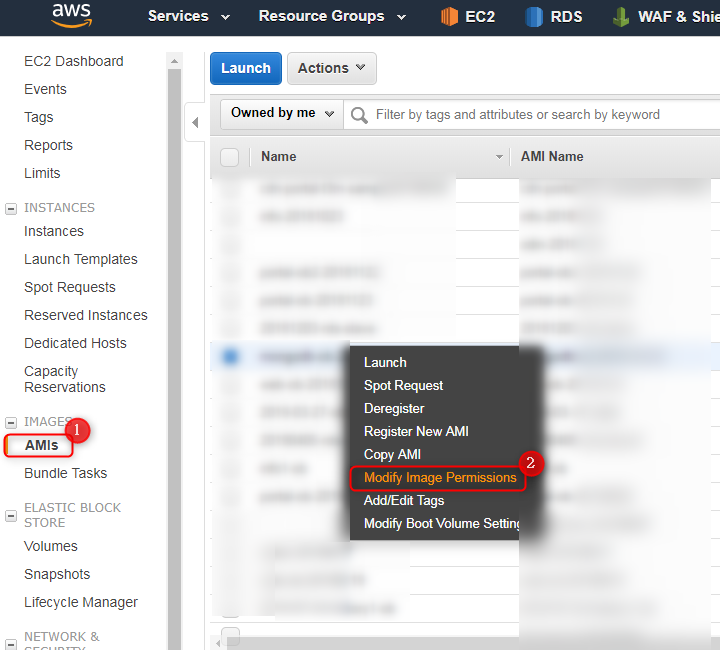
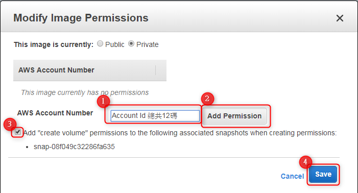

+++
author = "Hugo Authors"
title = "AWS-AMIs授權給其他帳號"
date = "2022-08-05"
#description = ""
categories = [
    "AWS"
]
tags = [
    "AWS",
]
image = "100.png"
+++

    到AWS控制台
    
    選擇AMIs > 點選 Modify Image Permissions    
   
   
    輸入 新帳號的Account Id > Add Permission > 下面的勾勾打勾 > save
   
   
    再到新帳號的AWS控制台> EC2 > AMIs > private images 即可看到剛剛授權的AMIs
   
   
   [官方文件](https://docs.aws.amazon.com/zh_tw/AWSEC2/latest/UserGuide/sharingamis-explicit.html)
   
   

***




