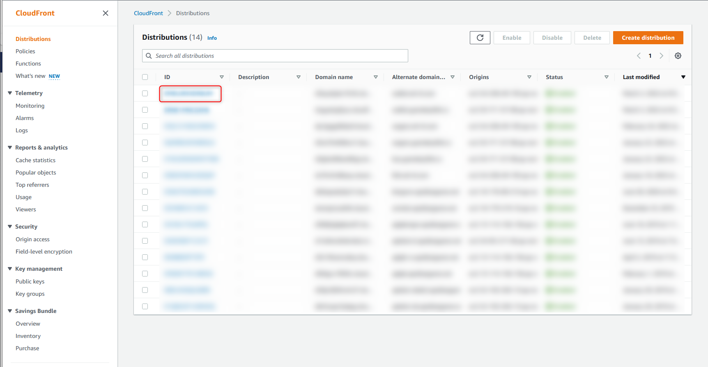
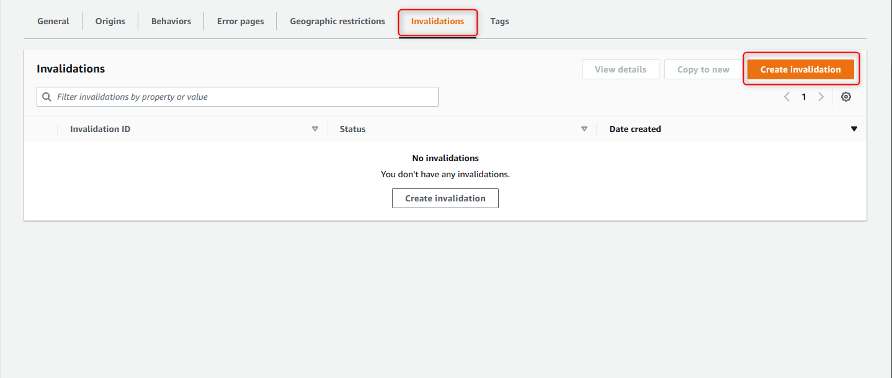
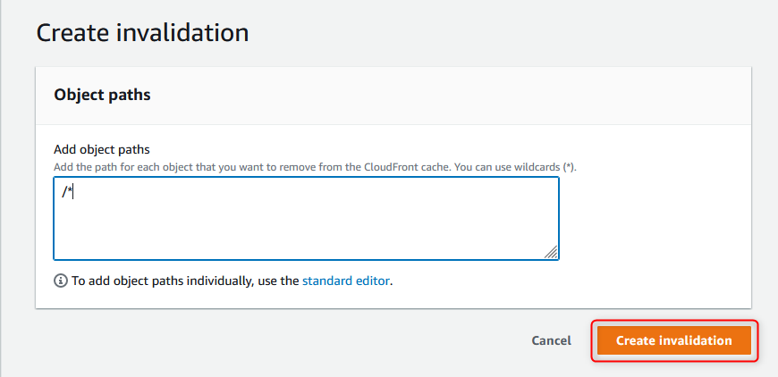

+++
author = "Hugo Authors"
title = "AWS-Cloudfront CDN快取清除"
date = "2022-09-08"
#description = ""
categories = [
    "AWS"
]
tags = [
    "AWS",
]
image = "100.png"
+++

    到AWS-Cloudfront後台 選取要清除暫存的SITE
   
   
    選取Invalidations 
   
   
    /* 表示清除所有 再點選Create invalidation即可
   
    

***




