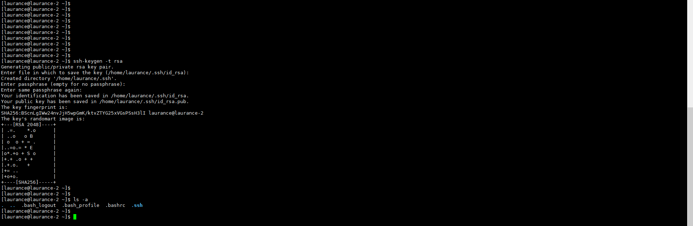
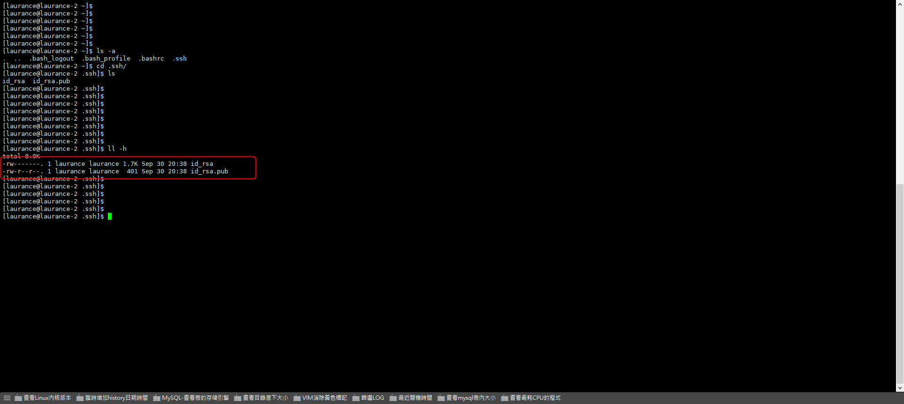
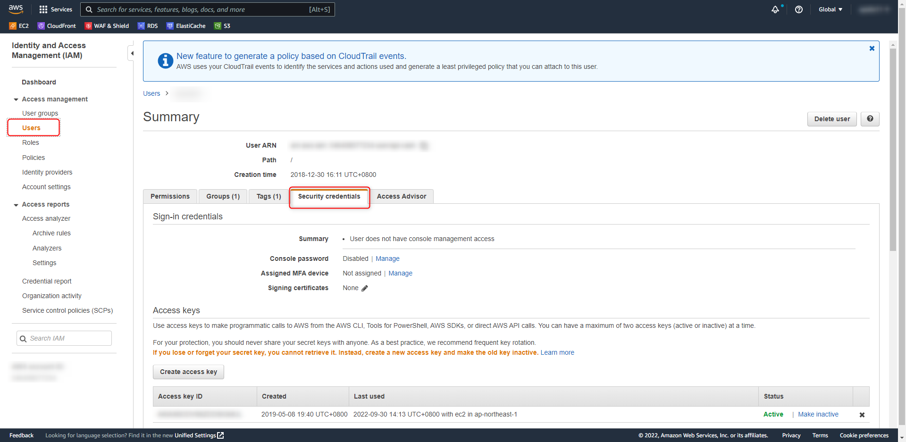
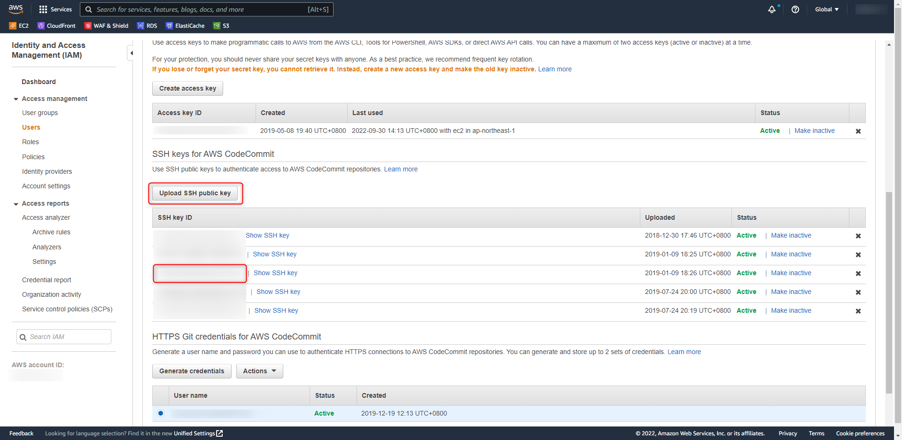
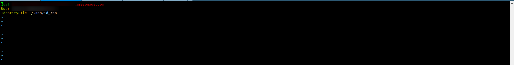
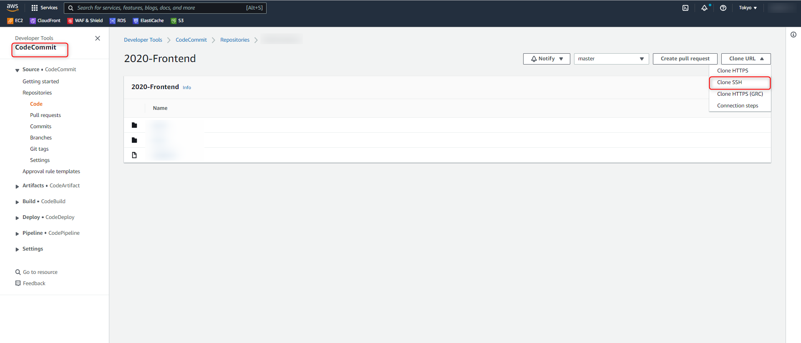
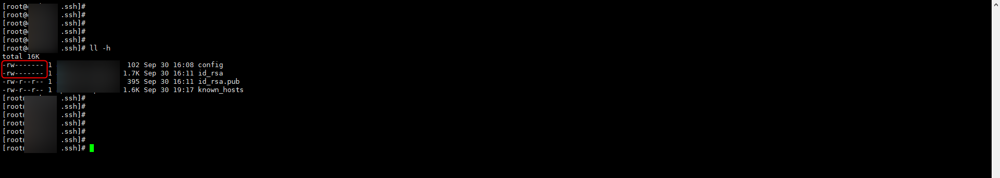

+++
author = "Hugo Authors"
title = "AWS-Codecommit SSH 金鑰上傳及設置"
date = "2022-09-30"
#description = ""
categories = [
    "AWS"
]
tags = [
    "AWS",
]
image = "100.png"
+++

    先到個人帳號家目錄下的.ssh 製作金鑰
   
   
    製作完後會有兩支檔案
   
   
    製作完後將id_rsa.pub 上傳至AWS-IAM個人帳號
   
   
    上傳後會得到SSH密鑰 ID
    
    將ID複製下來
   
   
    再回到機器帳號跟目錄下的.ssh
    
    vim config
    Host git-codecommit.ap-northeast-2.amazonaws.com < --只需要地區，目錄不用
    User SSH密鑰 ID
    IdentityFile ~/.ssh/id_rsa <--私鑰檔案路徑
   

    Codecommit的位置取得
   
   
    新增完成後將檔案權限改為 600
    chmod 600 config
   
    
    即完成設定

***




