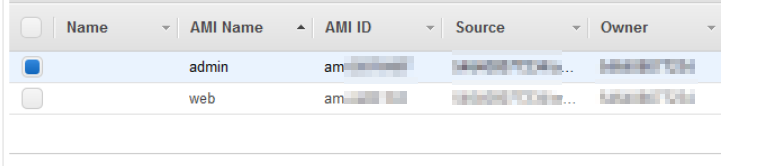

+++
author = "Hugo Authors"
title = "AWS-EC2 AMI轉地區&帳號"
date = "2022-09-08"
#description = ""
categories = [
    "AWS"
]
tags = [
    "AWS",
]
image = "100.png"
+++

    在ec2→ami底下Actions選Copy AMI
   
   
    在Destination region 選擇要移轉的地區
   
   
    在Pemissions底下按edit
   
   

    在AWS Account Number 輸入要移轉的帳號
   

***




