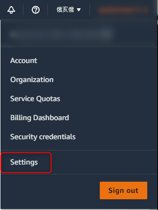
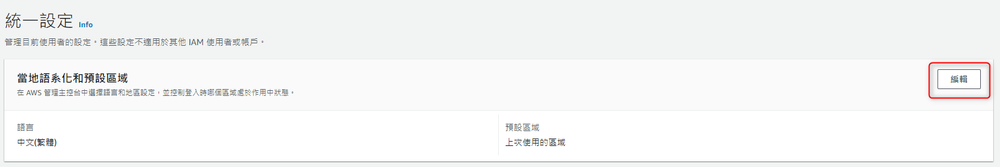

+++
author = "Hugo Authors"
title = "AWS-變更 Management Console 的語言"
date = "2022-09-08"
#description = ""
categories = [
    "AWS"
]
tags = [
    "AWS",
]
image = "100.png"
+++

    登入 AWS Management Console
    
    在導覽列上選擇您的帳戶名稱
    
    選擇 Settings (設定)，開啟 Unified Settings (統一設定) 頁面
    
   
   
    在 Unified Settings (統一設定) 中，選擇位於 Localization and default Region (本地化和預設區域) 旁的 Edit (編輯)
    
    選取您想在主控台使用的語言，然後選擇 Save changes (儲存變更)
    
   

***




