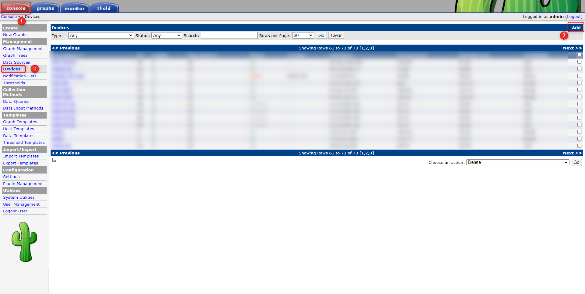
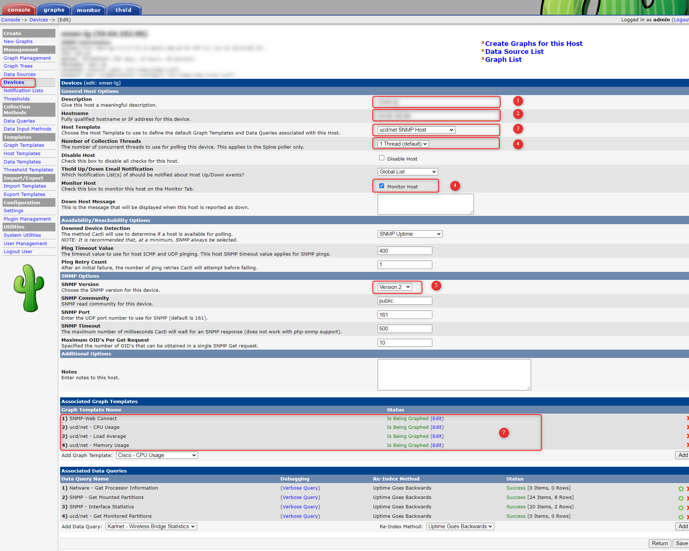
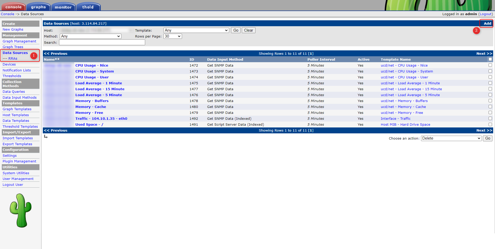
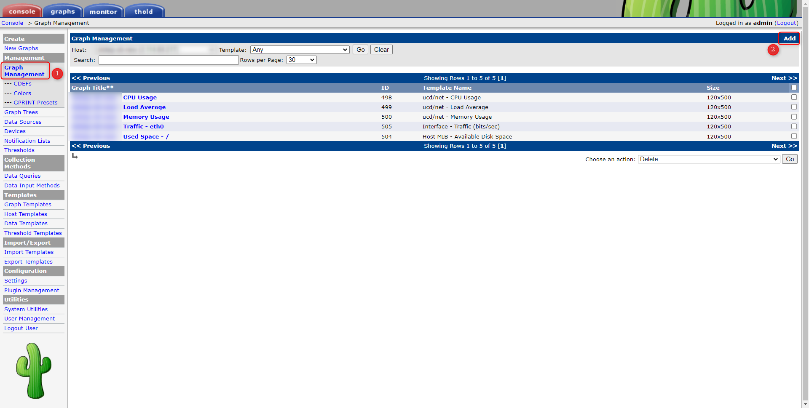
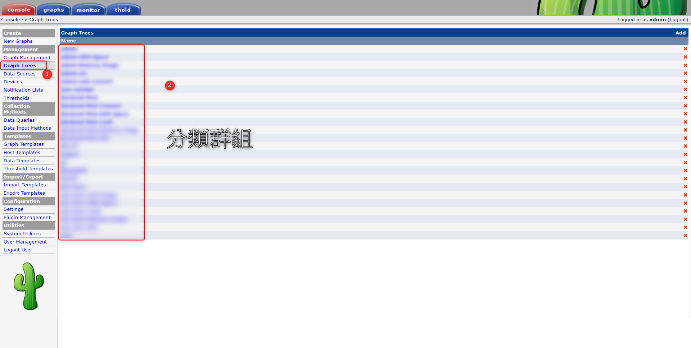

+++
author = "Hugo Authors"
title = "Cacti-新增機器及圖表"
date = "2022-09-14"
description = "(新建EC2加入Cacti監控)"
categories = [
    "Cacti"
]
tags = [
    "Cacti",
]
image = "100.jpg"
+++

    1. 新建機器上面先安裝SNMP，並確保火牆有通 UDP161port
        yum install -y net-snmp  net-snmp-utils
    
    2. Cacti 頁面新增 Device >> Add
   
   
    3. Device 填入機器的 hostname 及監控協議
   
   
    4. Datasource 新增要撈取的資料
   
   
    5. Graph Management 新增監控圖表
   
   
    6. Graph Trees 分類圖表群
   
   
   

***




