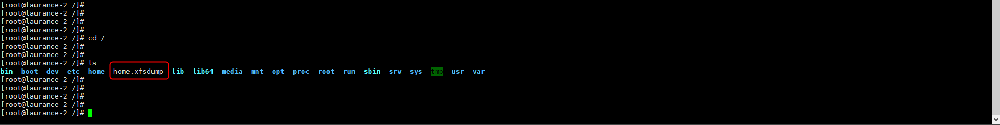

+++
author = "Hugo Authors"
title = "CentOS-根目錄磁區擴充"
date = "2022-08-03"
description = "(將home磁區分割為50G並將其餘空間擴充到根目錄底下)"
categories = [
    "Linux"
]
tags = [
    "CentOS",
]
image = "100.png"
+++

    安裝xfsdump工具
    yum install xfsdump -y

    備份/home磁區的掛載內容 (一路按ENTER)
    xfsdump -f /home.xfsdump /home
   
   
    這時候會再跟目錄出現剛剛備份的 /home >> home.xfsdump
   
   
    成功備份後，將/home磁區移除掛載 (必須以root身分登入才能執行)
    umount /home
   

    將/home磁區大小定義為50G
    lvreduce -L 50G /dev/mapper/centos-home
   

    將其餘空間擴充到根目錄底下
    lvextend -l +100%FREE /dev/mapper/centos-root
   

    使根目錄擴充生效
    xfs_growfs /dev/mapper/centos-root
   

    格式化/home掛載對應的磁區
    mkfs.xfs -f /dev/mapper/centos-home
   

    重新掛載/home
    mount /home
   

    將原本備份的內容寫入/home
    xfsrestore -f /home.xfsdump /home
   
   
    可以看倒已將磁區容量擴充
   

***




