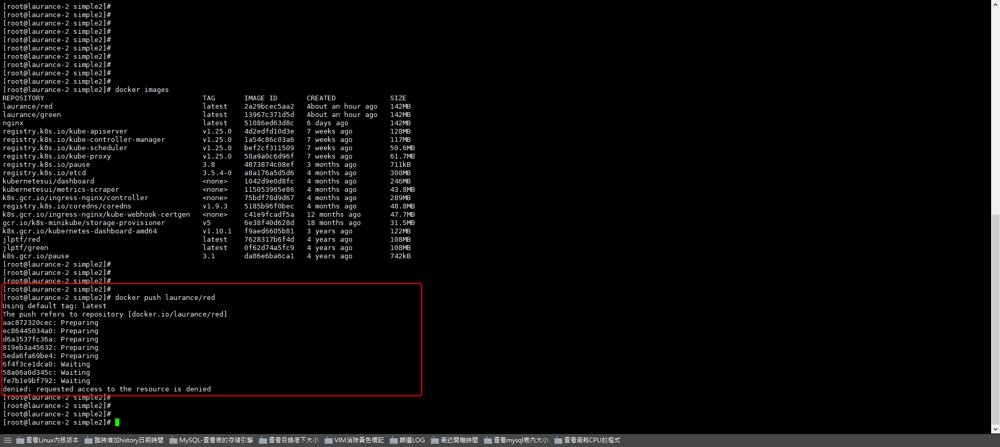
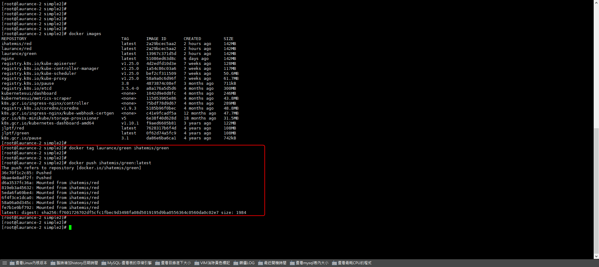
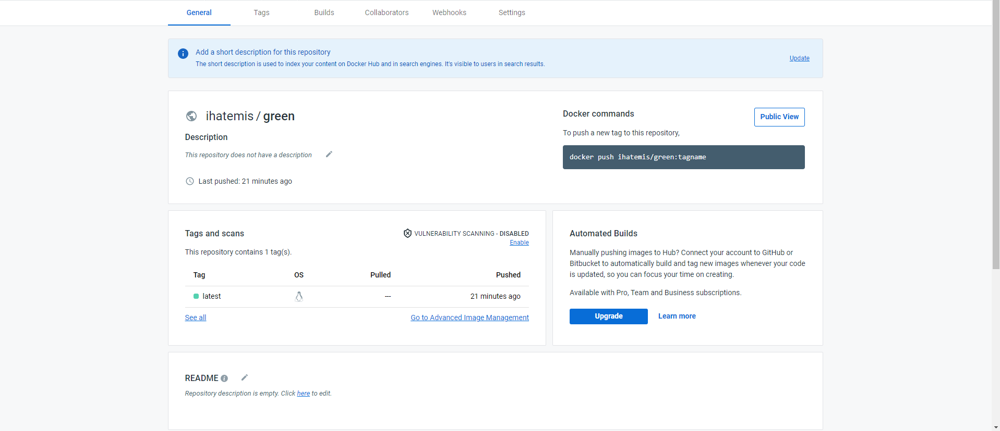

+++
author = "Hugo Authors"
title = "Docker-Error-requested access to the resource is denied"
date = "2022-09-13"
description = "上傳鏡像被拒絕 Denied"
categories = [
    "Docker"
]
tags = [
    "Docker",
]
image = "100.png"
+++

    上傳 image 報錯
    
    docker push laurance/green
    
    denied: requested access to the resource is denied
    
   
   
   **解决方案**
   
    docker tag laurance/green ihatemis/green
    
    ihatemis 為 Docker hub 用戶名
    
   
   
    後台查看已上傳
    
   
   
   
   
    

***




