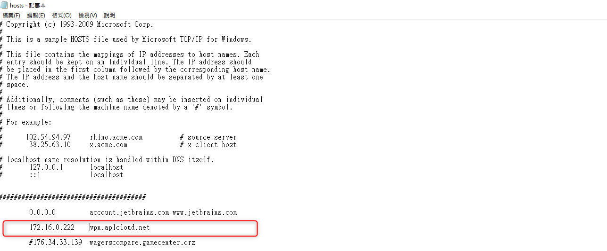
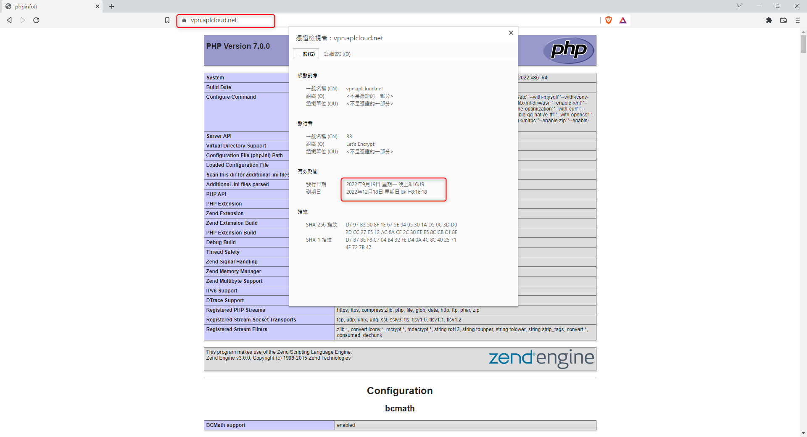
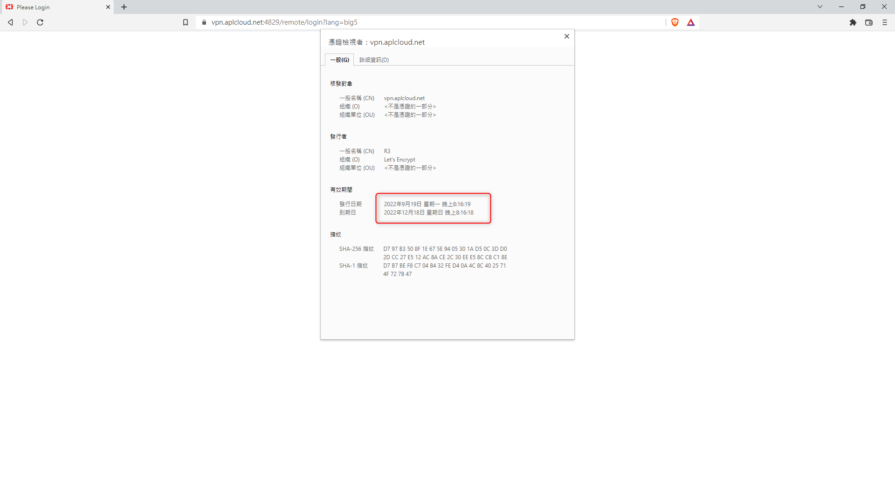

+++
author = "Hugo Authors"
title = "Fortinet-FortiGate60E SSL匯入自簽3個月憑證"
date = "2022-09-20"
description = "(SSL-VPN匯入PKCS12憑證)"
categories = [
    "FortiGate"
]
tags = [
    "FortiGate",
]
image = "100.png"
+++

    1. 使用certbot-auto簽發三個月憑證,並驗證TXT
   
   
    2. 將兩隻key丟到nginx目錄測試(fullchain1.pem >> XXX.crt , privkey1.pem >> XXX.key)
   
   
    3. Nginx重啟reload
   
   
    4. 將解析綁到本機hosts
   
   
    5. 開啟剛剛設置的域名,查看憑證是否設定正確
   
   
    6. 使用openssl將兩隻key合併生成XXX.pfx (fortigate支援的格式) ps.會強制設定密碼
   
   
    7. 將剛剛製作的憑證XXX.pfx上傳至fortigate後台,並輸入剛剛設置的密碼
   
   
    8. Fotigate後台,SSL-VPN設定這邊的伺服器憑證選單裡就會出現剛剛設置的三個月憑證
   
   
    9. 驗證查看 >> 已出現剛剛製作的憑證
   

***




