+++
author = "Hugo Authors"
title = "Fortinet-FortiGate60E SSL-VPN設置"
date = "2022-09-18"
description = "(實現分群連接SSL-VPN)"
categories = [
    "FortiGate"
]
tags = [
    "FortiGate",
]
image = "100.png"
+++

    1. 網路 >> 介面切 WAN1 對應外網 (設定成VPN入口) 
    
       (Group1: 172.16.198.50-172.16.198.100 >> ADDR1)
       (Group2: 172.16.198.101-172.16.198.150 >> ADDR2)
       
       其餘port設定為LAN口 (internal:port1-7) IP/遮罩 172.16.0.55/16 關閉DHCP
       
       (默認會無法解放LAN-Port,因為被其他位置占用,解除之後就可以了)
   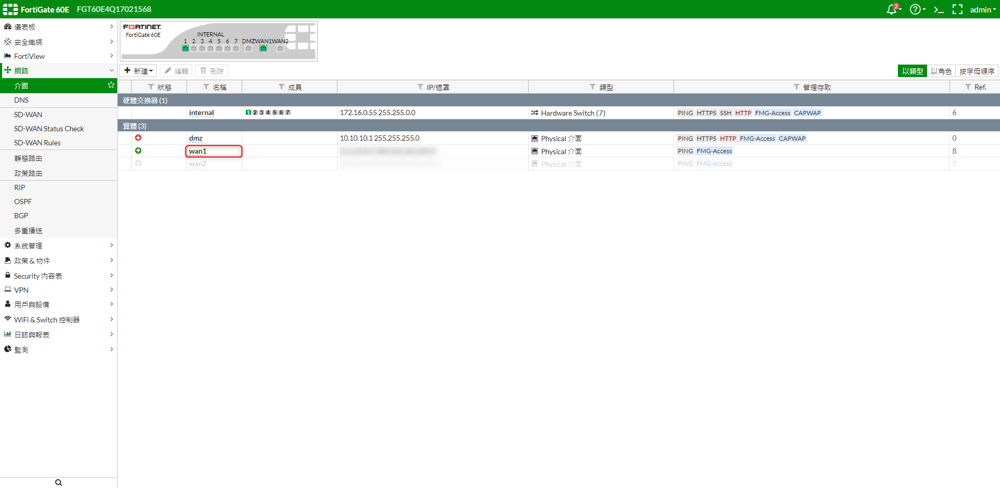
   
    2. 設置辦公室內部DNS
   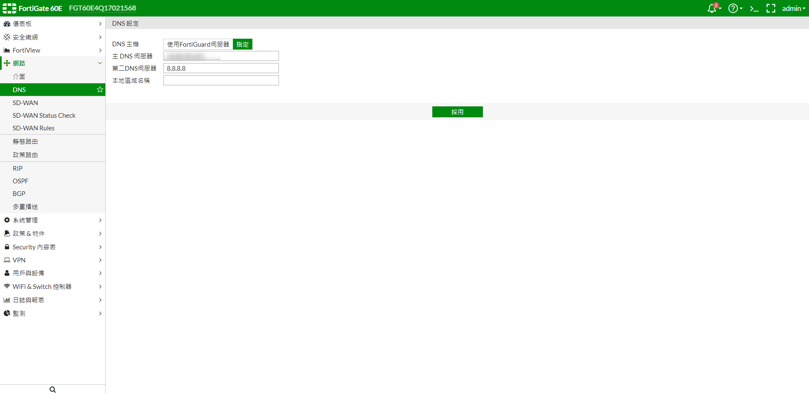
   
    3. 開啟進階功能開關 >> 系統管理 Feature Visibility (其餘依照環境設置)
   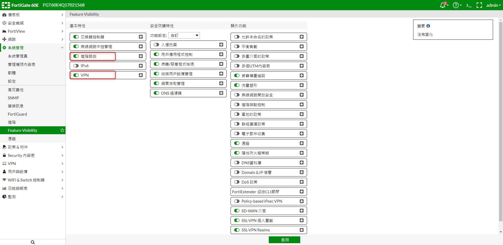
   
    4. 新增位址 >> 內部 Internal-IP
   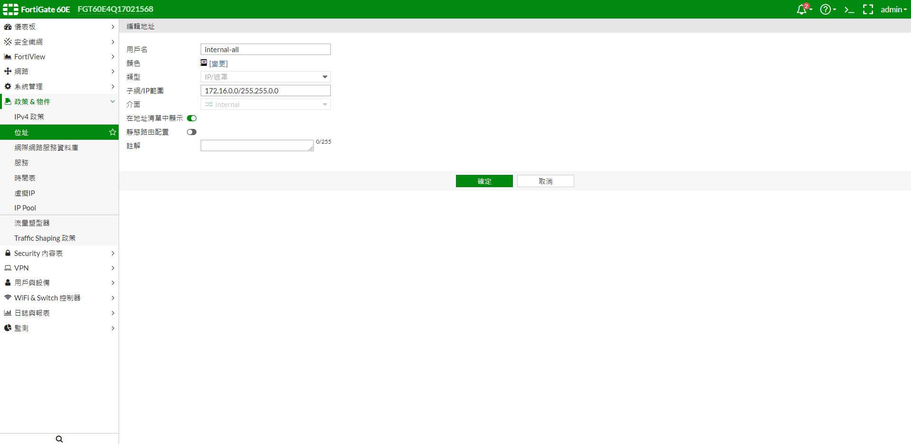
   
    5. 新增位址 >> SSLVPN_TUNNEL_ADDR1 , SSLVPN_TUNNEL_ADDR2 (做2個VPN通道)
   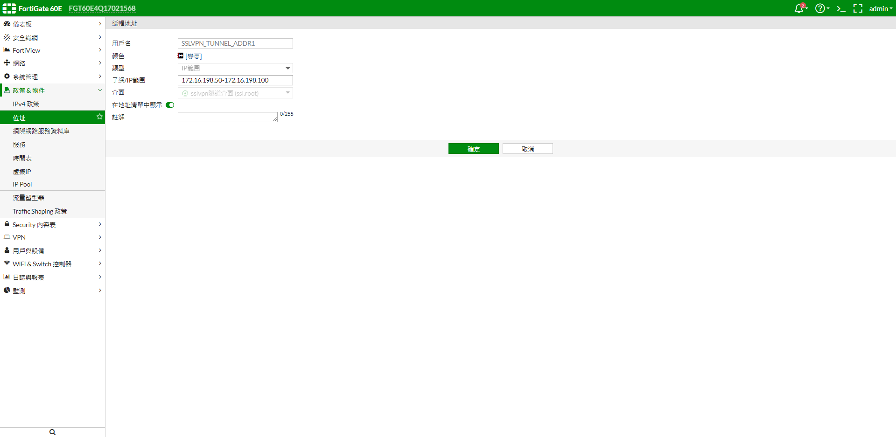
   
   
   
    6. SSL-VPN入口頁面 >> 新建 VPN-GROUP1 , VPN-GROUP2 對應 ADDR1 , ADDR2
   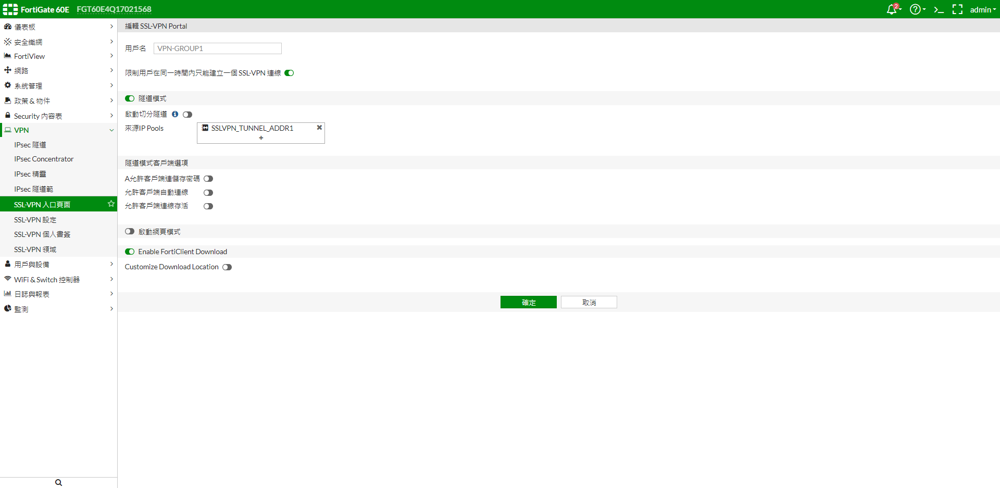
   
       
   
    7. 設置靜態路由 WAN1 (VPN入口)
   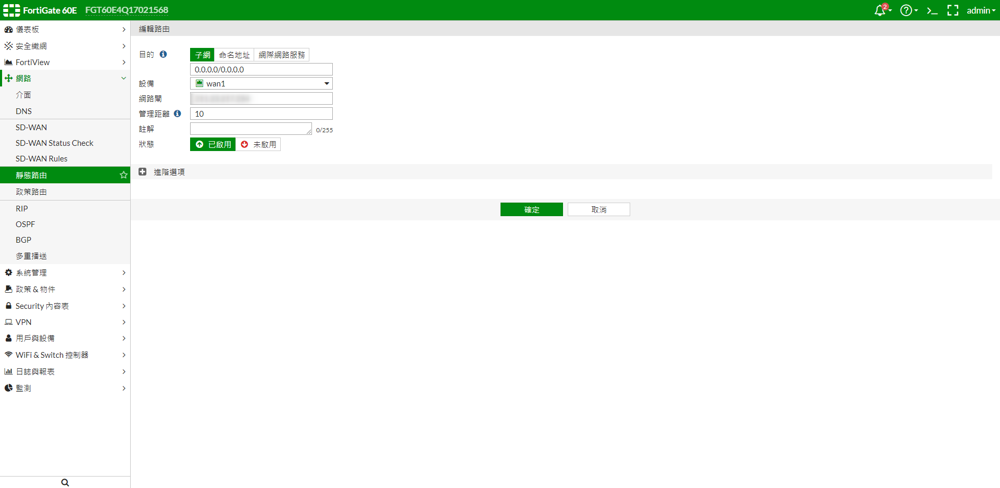
   
    8. 設置政策路由 (設置WAN1出口,來源分兩個 Group)
   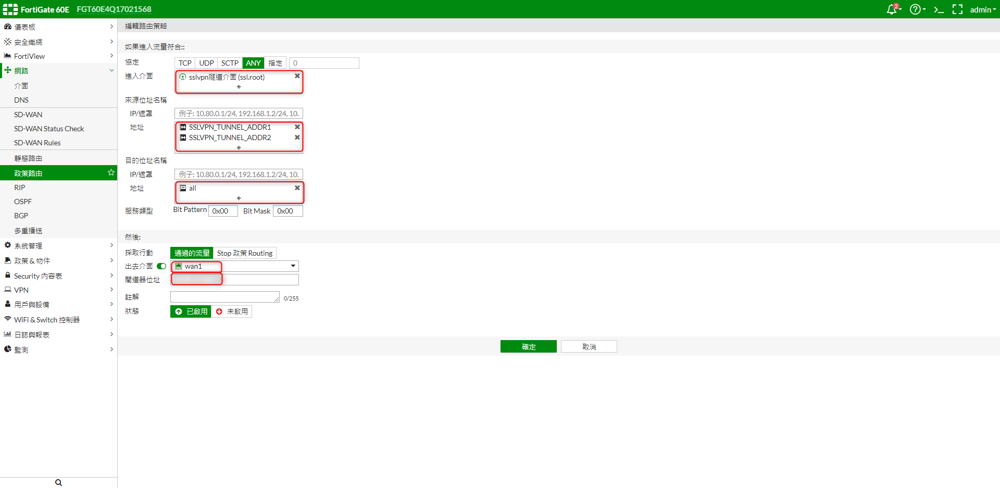
   
   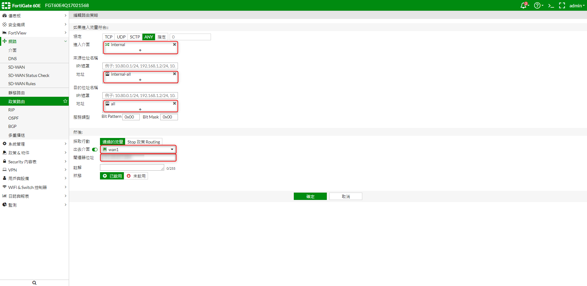
   
   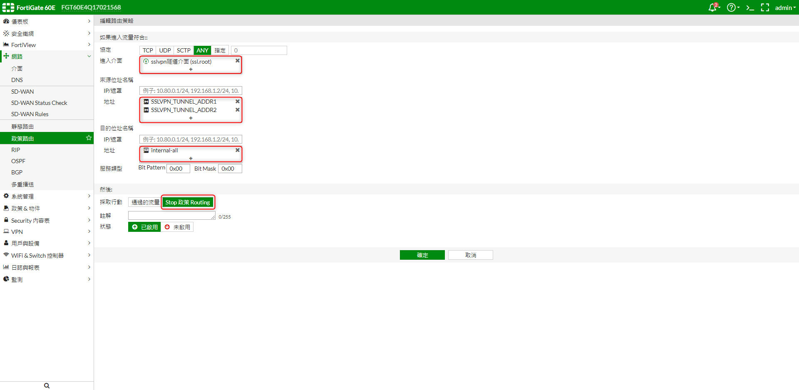
   
    9. IP Pool >> 新建IP池 (外部IP設置自己到自己)
   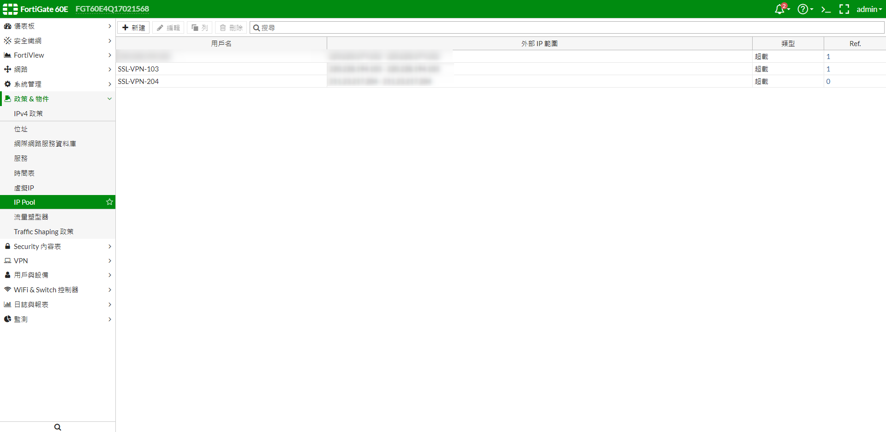
   
    10. 新增用戶群組
   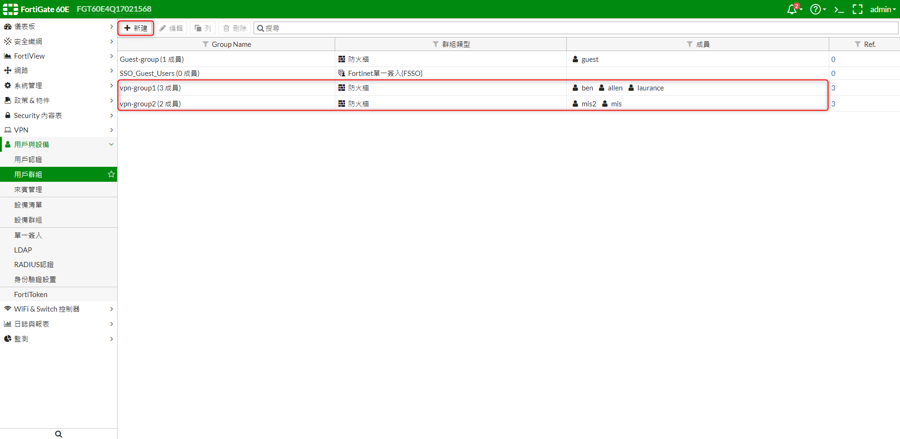
   
    11. SSL-VPN設定 >> 監聽走WAN1 , 4826Port , IP範圍:ADDR1,ADDR2 , 認證入口對應群組
   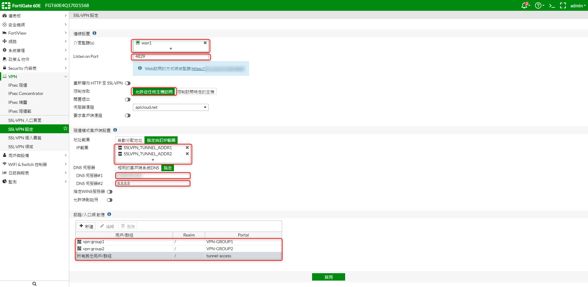
   
    12. 新增IPV4政策 
    
    (internal-wan1) (SSLVPN-LAN) (SSLVPN-WAN1)
   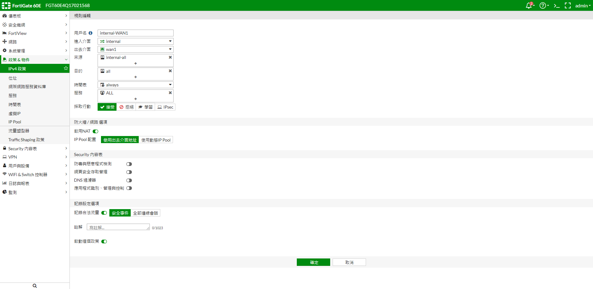
   
   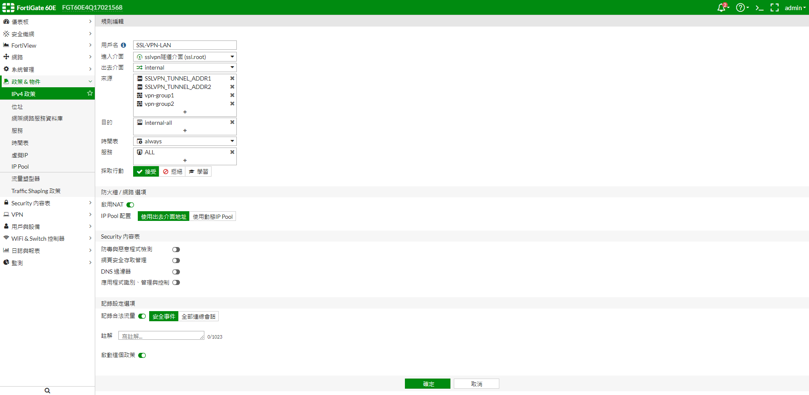
   
   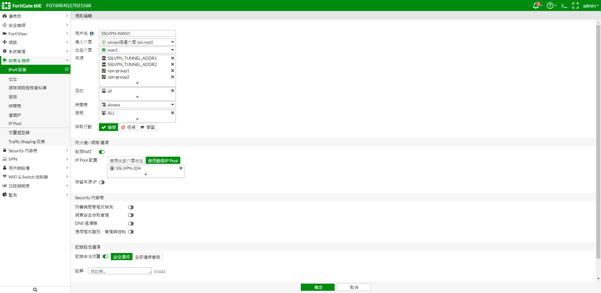
   
   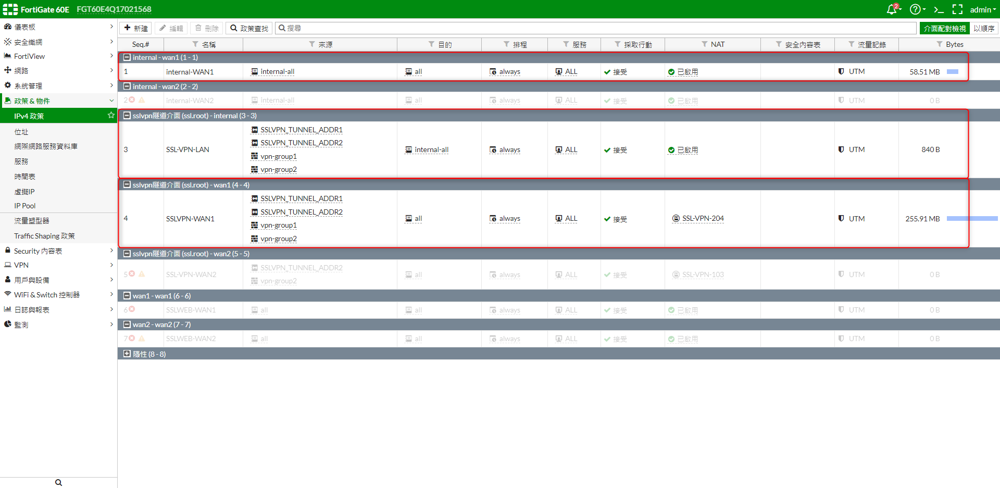

***




