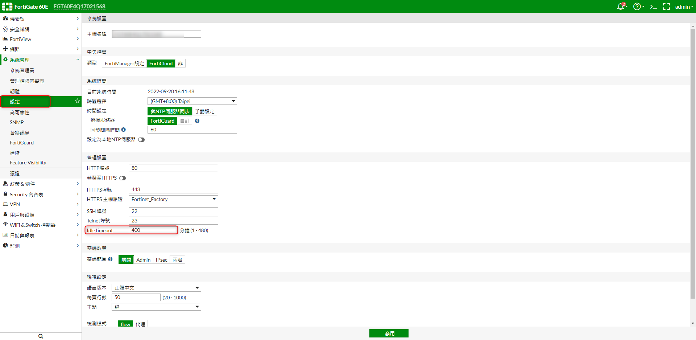

+++
author = "Hugo Authors"
title = "Fortinet-FortiGate60E 延遲自動登出設定"
date = "2022-09-20"
description = "(解決延遲登出時間過短)"
categories = [
    "FortiGate"
]
tags = [
    "FortiGate",
]
image = "100.png"
+++

    1. 修改閒置時間
   

***




