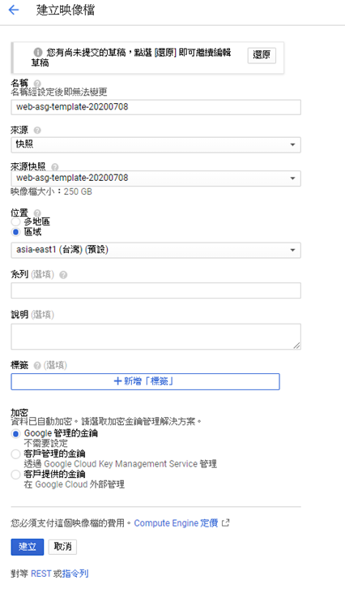
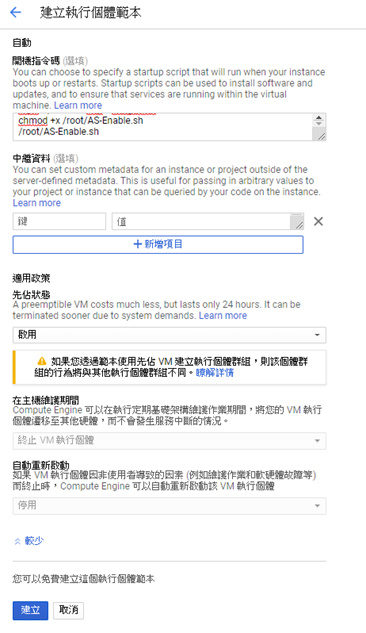
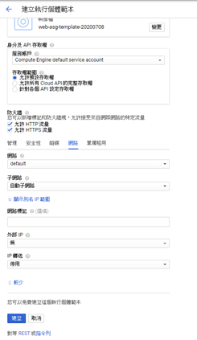
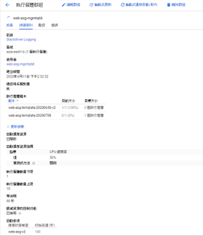
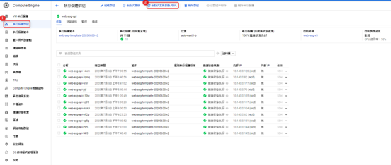
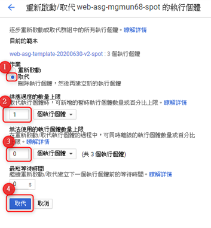

+++
author = "Hugo Authors"
title = "GCP- ASG執行範本建立與更新"
date = "2022-10-03"
#description = ""
categories = [
    "GCP"
]
tags = [
    "GCP",
]
image = "100.png"
+++

    模板機先建立快照 >> 再轉映像檔  
    
    區域選台灣 >> 按建立
   
   
   
    建立執行個體範本
    
   
   
    建立執行個體範本 網路分頁將外部IP 更改成無；勾選允許HTTP、HTTPS流量
    
   
   
    建立完畢後 編輯執行個體群組 套用新的 執行個體範本 確認有出現後
    
    再開始進行web滾動更新
    
   
   
    GCP ASG-web滾動更新
    
    選擇執行各體群組 > 輪動式重新啟動/取代

   
   
    點選取代 > 供應過度數量上限填1 > 無法使用的數量寫0  > 取代
    
   
    
    PS:供應過度的數量上限: 是指滾動時，可超過當下存在的機器數量的上限
    如果原本上限是8台，填1時，滾動時上限可為9台
    如果是上班時段，建議填寫目前機器數量，滾動速度會比較快一點
    如果是維護其間，可填寫1 讓它慢慢替換
    
    -----------------------------------------------------------------------------------------------------------------
    
    無法使用的執行個體數量上限: 是指滾動時，群組裡面能有幾台無法使用
    這邊不管是上班或是維護期間 都應填寫0

    
   
    
   

***




