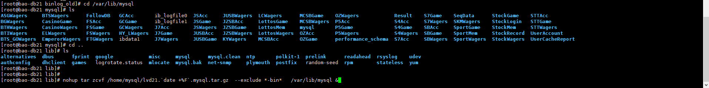
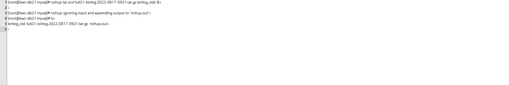
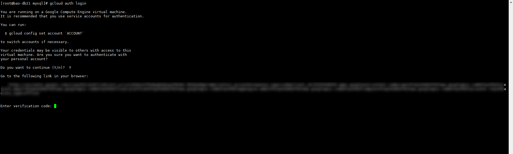
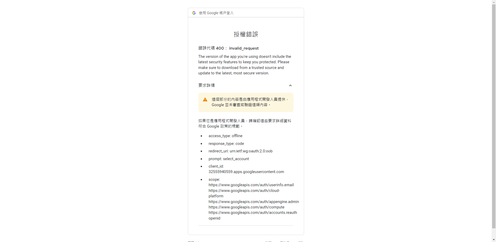
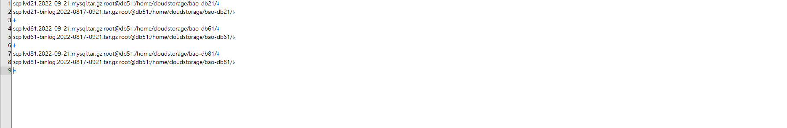
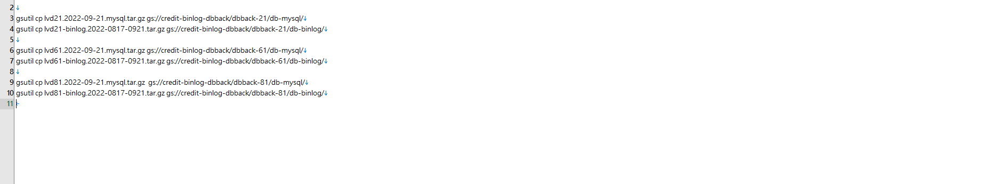

+++
author = "Hugo Authors"
title = "GCP-將MySQL-DB及BINLOG備份至Cloudstorage"
date = "2022-09-21"
#description = ""
categories = [
    "GCP"
]
tags = [
    "GCP",
]
image = "100.png"
+++

    1. 使用 nohup+& 背景執行資料庫壓縮 (除掉binlog)
   
   
    2. 取第一支binlog跟最後一隻binlog的日期 (當作到時候壓縮的檔名)
   
   
    3. 使用 nohup+& 背景執行binlog壓縮
   
   
    4. 原本的驗證機制被刪除了 (gcloud auth login)
   
   
   
   
    5. 將壓縮好的TAR包傳到中繼機 (之前跟GCP驗證過的機器)
   
   
    6. 上傳到GCP對應的目錄
   
   
   

***




