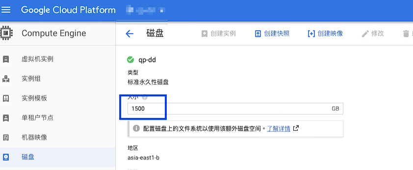

+++
author = "Hugo Authors"
title = "GCP-硬碟擴容"
date = "2022-10-06"
#description = ""
categories = [
    "GCP"
]
tags = [
    "GCP",
]
image = "100.png"
+++

    GCP上，點選硬盤，直接修改想要的硬盤大小(只能擴大、不能縮小)
    
   
   
    看一下目前的硬碟空間 lsblk
    
    會發現從 1.3T 變成 1.5T，但是用 df -h 卻沒看到空間增加
    
擴大分割區  

以下是針對 sda 的第一個分割區擴大

    yum install cloud-utils-growpart
    
    growpart /dev/sda 2
    
擴大檔案系統空間  

如果是 ext2, ext3, ext4 的 file system，則用 resize2fs，如果是 xfs，則用 xfs_growfs

    xfs
    
    xfs_growfs /dev/sda2
    
    ext4
    
    resize2fs /dev/sda2
   

***




