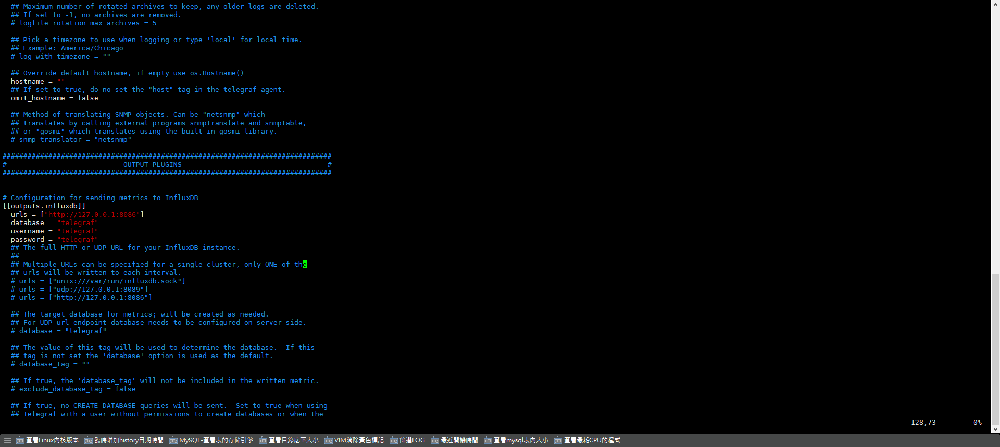
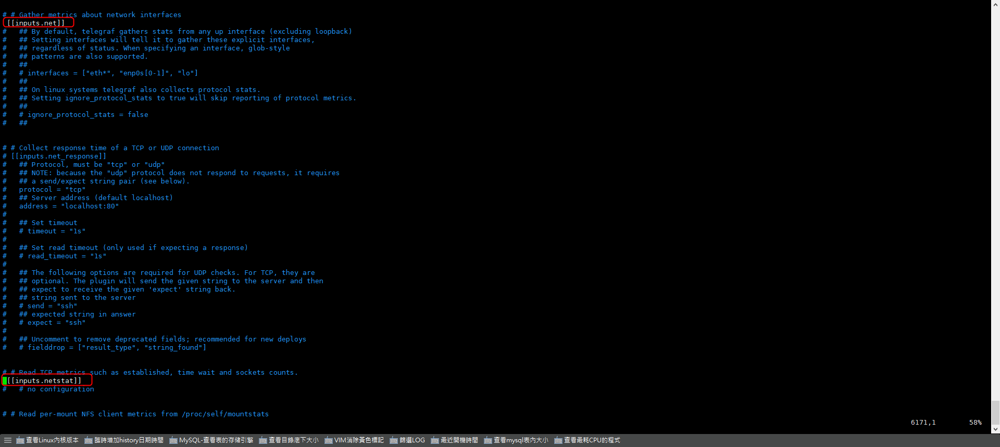
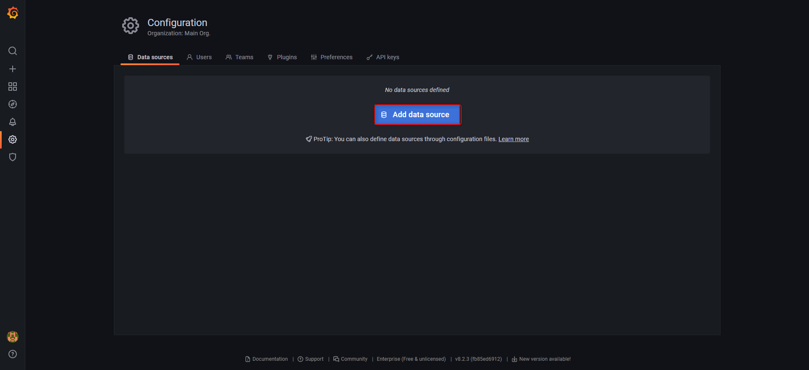
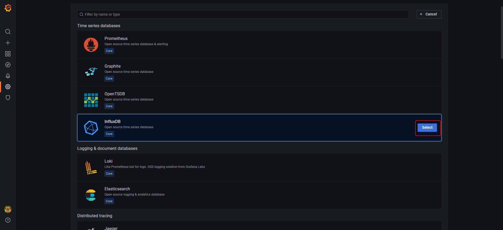
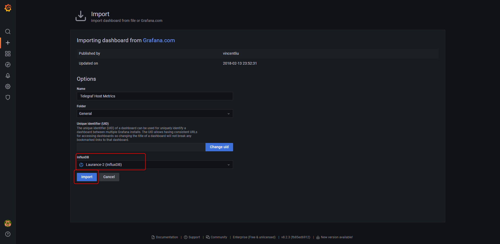

+++
author = "Hugo Authors"
title = "Grafana + influxdb + telegraf , 構建Linux效能監控"
date = "2022-09-27"
#description = ""
categories = [
    "Grafana",
    "influxdb",
    "telegraf"
]
tags = [
    "Grafana",
    "influxdb",
    "telegraf"
]
image = "100.png"
+++

   [Grafana 官方載點](https://grafana.com/grafana/download)
   
   以下用YUM方式安裝 Grafanae-8.2.3-1
    
    wget https://dl.grafana.com/enterprise/release/grafana-enterprise-8.2.3-1.x86_64.rpm
    
    yum localinstall grafana-enterprise-8.2.3-1.x86_64.rpm
    
    #啟動服務
    systemctl start grafana
    
    #檢視服務狀態
    systemctl status grafana
    
   [InfluxDB 官方載點](https://portal.influxdata.com/downloads/)
   
   以下用YUM方式安裝 InfluxDB v1.8.0

    # influxdb.key GPG Fingerprint: 05CE15085FC09D18E99EFB22684A14CF2582E0C5
    cat <<EOF | sudo tee /etc/yum.repos.d/influxdb.repo
    [influxdb]
    name = InfluxDB Repository - RHEL \$releasever
    baseurl = https://repos.influxdata.com/rhel/\$releasever/\$basearch/stable
    enabled = 1
    gpgcheck = 1
    gpgkey = https://repos.influxdata.com/influxdb.key
    EOF
       
    sudo yum install influxdb
    
   [Telegraf 官方載點](https://portal.influxdata.com/downloads/)
   
   以下用YUM方式安裝 Telegraf v1.24.1
   
    # influxdb.key GPG Fingerprint: 05CE15085FC09D18E99EFB22684A14CF2582E0C5
    cat <<EOF | sudo tee /etc/yum.repos.d/influxdata.repo
    [influxdata]
    name = InfluxData Repository - Stable
    baseurl = https://repos.influxdata.com/stable/\$basearch/main
    enabled = 1
    gpgcheck = 1
    gpgkey = https://repos.influxdata.com/influxdb.key
    EOF
    
    sudo yum install telegraf
    
   Step.1 修改Telegraf的設定檔並啟動:   
   
   (將output-influxdb打開並指向database-telegraf,及打開network參數,及新增使用者)
   
   
   
   
    
    service telegraf start
    
   Step.2 啟動influxdb,並查看資料有沒有正確寫進去DB
   
    service influxdb start
  
  
   Step.3 建立telegraf使用者,並給予權限
   
    create user telegraf with password 'telegraf'
    
    grant all on telegraf to telegraf

   Step.4 啟動grafana
   
    systemctl start grafana-server
    
   Step.5 開啟後台 http://localhost:8086 並建立datasource
  
  

  
  
  
  
  
  
  Step.6 匯入Grafana官方模板
  
  
  
  
  
  
  
  Step.7 驗證: 打開本機3000port
  
  
    
***




