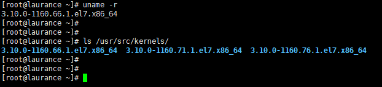
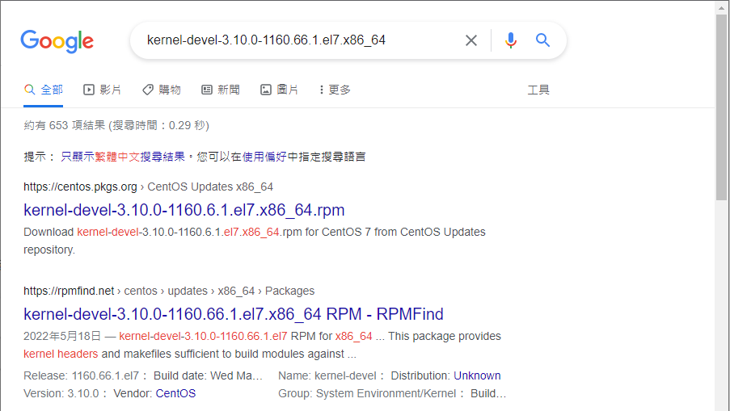
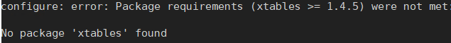
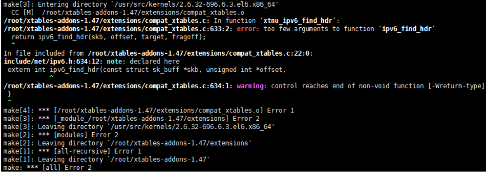
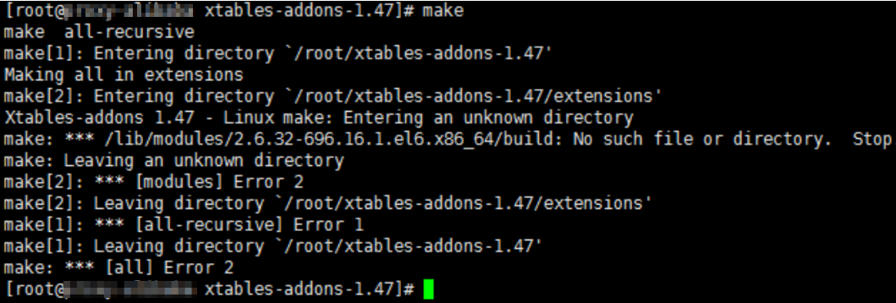
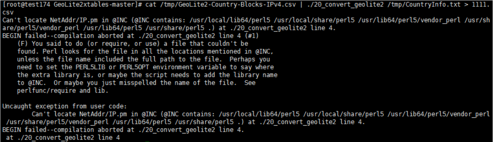
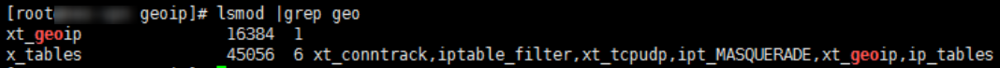
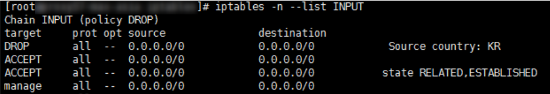

+++
author = "Hugo Authors"
title = "centos7 內核3.10.0-957 iptables 使用geoip過濾國家"
date = "2022-09-08"
#description = ""
categories = [
    "Linux"
]
tags = [
    "Iptables",
]
image = "100.jpg"
+++

    
    安裝必要套件
    yum install xz gcc make wget unzip kernel-devel-$(uname -r) iptablesdevel.$(uname -p) perl-Text-CSV_XS
    
    確認目前的kernel版本
    uname -r
    
    確認底下的目錄名稱必須要跟上個步驟的版號完全相同，若不同時請確認yum安裝的kerneldevel套件版本，對不上時有下列幾種做法
    ls /usr/src/kernels/
    
   
    
    1) 一般、非客制化Linux版本，請參照下述
    
    移除目前裝的版本
    rpm -e kernel-devel
    
    至 rpm包網站 http://rpm.pbone.net 下載與kernel相同版號的 kernel-devel
    wget *.rpm
    
   
   
    解壓kernel-devel套件
    rpm -hiv *.rpm
    
    確認目前的kernel版本
    ls /usr/src/kernels/
    
    確認套件版本
    uname -r
  ---
    2) Aamzon EC2請參照下述
    
    移除目前裝的版本
    rpm -e kernel-devel
    
    kernel版本升級
    yum install kernel
    
    重開機
    reboot
  
    確認目前的kernel版本
    uname -r
    
    再次yum安裝kernel-devel套件
    yum install kernel-devel-$(uname -r)
    
    確認套件版本
    ls /usr/src/kernels/
    
    確認iptables版本
    iptables -V
    
    下載與iptables相對應的套件版本
    wget xtables-addons-*.tar.xz
   [Iptables套件載點](https://sourceforge.net/projects/xtables-addons/files/Xtablesaddons/)
    
    #iptables 1.47請用 xtables-addons-1.47.tar.xz
    #aws-ec2 請用 xtables-addons-3.0.tar.xz
    
    tar Jxf xtables-addons-1.47.tar.xz
    cd xtables-addons-1.47
    ./configure
    make
    make install
   ---
    編譯遇到以下錯誤
       
    
    yum -y install iptables-devel
    
    其中若有遇到問題，可調整mconfig中的模組留geoip即可。
   --- 
    若遇到 xtnu_ipv6_find_hdr' 錯誤處理程序如下
 
   
   
    使用/* */注解此行
    vim /lib/modules/`uname -r`/build/include/linux/autoconf.h
    #define CONFIG_IP6_NF_IPTABLES_MODULE 1 #
    
    或是進入extensions資料夾執行
    sed -i '/define WITH_IPV6/d' compat_xtables.c xt_psd.c xt_length2.c xt_TARPIT.c xt_SYSRQ.c xt_RAWNAT.c
    
   
   
    若鍽譯時遇到 /lib/modules/XXXX.x86_64/build/ 路徑錯誤時
    重新連結到正確的目錄
    
    cd /lib/modules/XXXX.x86_64/
    rm -rf build
    ln -s ../../../usr/src/kernels/XXX.x86_64/ build  
  ---    
    開始建立IP資料庫
    cd geoip
    
    若是使用付費版的GeoIP2 Databases源
    ./xt_geoip_dl
    ./xt_geoip_build GeoIPCountryWhois.csv
    
    若是使用免費版的GeoLite2 Databases源
    
    需要先注冊一個 maxmind.com 帳號後即可生成一個 License Key
   
   [註冊maxmind.com帳號](https://www.maxmind.com/en/geolite2/signup?lang=en) 
  
    下載轉格式工具程式GeoLite2xtables
    wget https://github.com/mschmitt/GeoLite2xtables/archive/master.zip
    
    unzip master.zip
    
    cd GeoLite2xtables-master
    
    echo "YOUR_LICENSE_KEY='你的金鑰'" >> geolite2.license
    
    echo "YOUR_LICENSE_KEY='tBobMt3HrPTWVJKP'" >> geolite2.license
    
    ./00_download_geolite2
    
    ./10_download_countryinfo
    
    cat /tmp/GeoLite2-Country-Blocks-IPv4.csv | ./20_convert_geolite2 /tmp/CountryInfo.txt > ../GeoIPCountryWhois.csv
    
    cd ..
    
    ./xt_geoip_build GeoIPCountryWhois.csv   
   ---   
    若是遇到下圖錯誤表示perl缺少模組
    
   
   
    yum install *YAML* perl-CPAN
    
    perl -MCPAN -e shell
    
    #預設回答yes即可
    
    cpan[1]> install NetAddr::IP
    
    cpan[1]> exit   
   ---   
    mkdir /usr/share/xt_geoip
    
    mv BE LE /usr/share/xt_geoip/
    
    確認是否有安裝成功
    lsmod|grep geoip
    
   

    一行命令中最多可以使用10個國家
    iptables -I INPUT -m geoip --src-cc PH,KR -j DROP
    
    只允許中國IP的TCP80連線
    iptables -A except -p TCP --dport 80 -m geoip --src-cc CN -j ACCEPT
    
    只允許中國IP的TCP80、443連線
    iptables -A except -p TCP -m multiport --dports 80,443 -m geoip --src-cc CN -j ACCEPT
    
    若是要加進火牆shell請用這組
    iptables -A pig -m geoip --src-cc tw -j DROP
    
    確認規則是不是有吃到
    iptables -n --list INPUT
    
   

   

***




