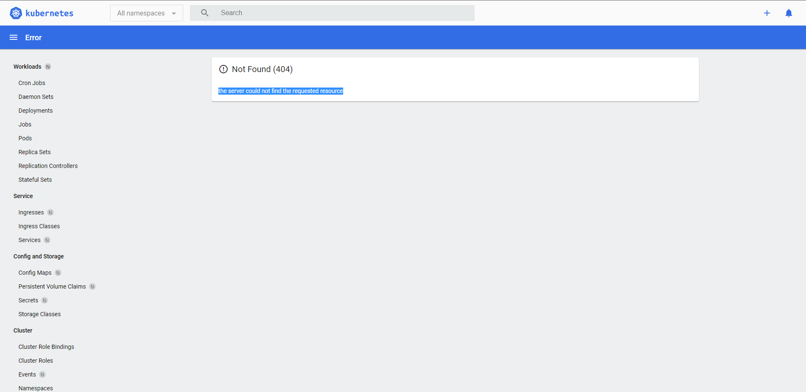
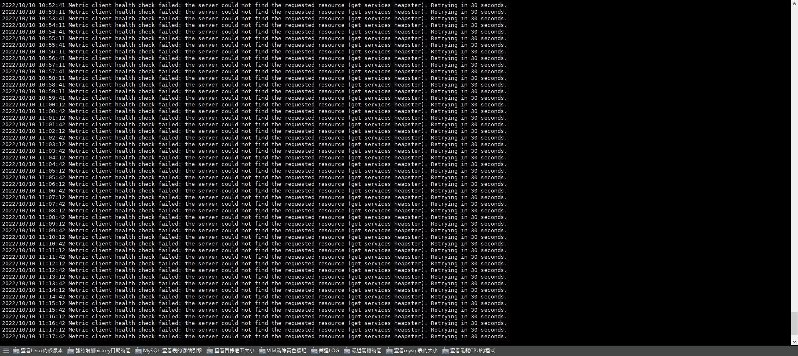
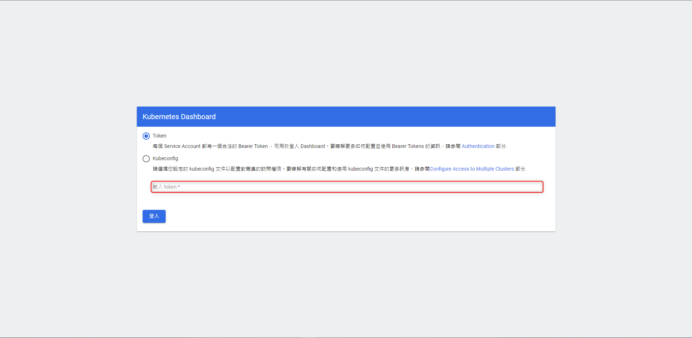

+++
author = "Hugo Authors"
title = "Kubernetes-ERROR-Metric client health check failed"
date = "2022-10-10"
description = "k8s dashboard 報錯: (404) the server could not find the requested resource"
categories = [
    "Kubernetes"
]
tags = [
    "Kubernetes",
]
image = "100.png"
+++

**dashboard 出現以下畫面**

   
   
**查看 dashboard pod 的 LOG**



# kubectl get pods -n kube-system|grep dash
kubernetes-dashboard-6ff6454fdc-78fnx   1/1     Running   0          4h8m



**K8s LOG 報錯 Metric client health check failed: the server could not find the requested resource (get services heapster). Retrying in 30 seconds**

   

**原因: kubernets用的比较高的版本，但dashboard版本用的比较低，因此報錯**

**解決: 重新安裝 dashboard 版本**

    先將舊的版本刪除 (將 dashboard 的 NS 刪除即可)
    


kubectl delete ns kubernetes-dashboard



    查看 kubernetes 版本
    


$ kubectl version --short
Flag --short has been deprecated, and will be removed in the future. The --short output will become the default.
Client Version: v1.25.2
Kustomize Version: v4.5.7
Server Version: v1.25.0


   
    根據 kubernetes 版本 下載相對應的 dashboard 版本
   [下載網址](https://github.com/kubernetes/dashboard/releases)
   


dashboard v2.0.0-beta5 —> kubernetes 1.16
dashboard v2.0.0 —> kubernetes 1.18
dashboard v2.0.1 —> kubernetes 1.18
dashboard v2.0.2 —> kubernetes 1.18
dashboard v2.0.3 —> kubernetes 1.18
dashboard v2.0.4 —> kubernetes 1.19
dashboard v2.0.5 —> kubernetes 1.19
dashboard v2.1.0 —> kubernetes 1.20
dashboard v2.2.0 —> kubernetes 1.20
dashboard v2.3.0 —> kubernetes 1.21
dashboard v2.3.1 —> kubernetes 1.21
    


    wget 下來修改 Service 的部分
    


wget https://raw.githubusercontent.com/kubernetes/dashboard/v2.7.0/aio/deploy/recommended.yaml



    修改為 Nodeport 方式訪問
    


kind: Service
apiVersion: v1
metadata:
  labels:
    k8s-app: kubernetes-dashboard
  name: kubernetes-dashboard
  namespace: kubernetes-dashboard
spec:
  type: NodePort #新添加的
  ports:
    - port: 443
      targetPort: 8443
      nodePort: 30003 #新添加的（可以改成其它的端口号，要大于30000）
  selector:
    k8s-app: kubernetes-dashboard

---



    執行 yaml 文件
    


# kubectl apply -f recommended.yaml

namespace/kubernetes-dashboard created
serviceaccount/kubernetes-dashboard created
service/kubernetes-dashboard created
secret/kubernetes-dashboard-certs created
secret/kubernetes-dashboard-csrf created
secret/kubernetes-dashboard-key-holder created
configmap/kubernetes-dashboard-settings created
role.rbac.authorization.k8s.io/kubernetes-dashboard created
clusterrole.rbac.authorization.k8s.io/kubernetes-dashboard created
rolebinding.rbac.authorization.k8s.io/kubernetes-dashboard created
clusterrolebinding.rbac.authorization.k8s.io/kubernetes-dashboard created
deployment.apps/kubernetes-dashboard created
service/dashboard-metrics-scraper created
deployment.apps/dashboard-metrics-scraper created



    建立 dashboard 管理員
    
    vim dashboard-admin.yaml
    
    kubectl create -f dashboard-admin.yaml
    


apiVersion: v1
kind: ServiceAccount
metadata:
  labels:
    k8s-app: kubernetes-dashboard
  name: dashboard-admin
  namespace: kubernetes-dashboard
  


    建立 RBAC 分配權限
    
    vim dashboard-admin-role.yaml
    
    kubectl create -f dashboard-admin-role.yaml
    


apiVersion: rbac.authorization.k8s.io/v1
kind: ClusterRoleBinding
metadata:
  name: dashboard-admin-role
  labels:
    k8s-app: kubernetes-dashboard
roleRef:
  apiGroup: rbac.authorization.k8s.io
  kind: ClusterRole
  name: cluster-admin
subjects:
- kind: ServiceAccount
  name: dashboard-admin
  namespace: kubernetes-dashboard
  


    kubectl get secret -n kubernetes-dashboard
    


NAME                               TYPE                                  DATA   AGE
dashboard-admin-token-fj9v6        kubernetes.io/service-account-token   3      95s
default-token-lj7xg                kubernetes.io/service-account-token   3      33m
kubernetes-dashboard-certs         Opaque                                0      33m
kubernetes-dashboard-csrf          Opaque                                1      33m
kubernetes-dashboard-key-holder    Opaque                                2      33m
kubernetes-dashboard-token-cdkzc   kubernetes.io/service-account-token   3      33m



    dashboard-admin-token 是剛剛創建的，再篩出 TOKEN 即可
    


kubectl describe -n kubernetes-dashboard secret/dashboard-admin-token-fj9v6|grep token:
token:      eyJhbGciOiJSUzI1NiIsImtpZCI6ImJyYjJDR18tMDQtdkc3MzBBN0RwQU8zTlVjV01PM2w0dGRBWVh5UXhPN3MifQ.eyJpc3MiOiJrdWJlcm5ldGVz



    輸入 https://172.16.0.223:30003 即可訪問 Dashboard ， 並輸入剛剛篩出的 TOKEN 
    
   




