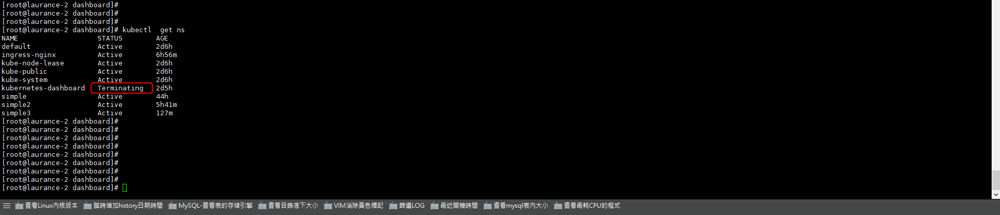
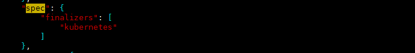
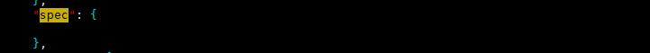
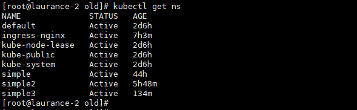

+++
author = "Hugo Authors"
title = "Kubernetes-ERROR-unable to create new content is being terminated"
date = "2022-10-12"
description = "kubernetes-dashboard 一直卡在 termnating，所以導致無法有效刪除."
categories = [
    "Kubernetes"
]
tags = [
    "Kubernetes",
]
image = "100.png"
+++

**查看 namespace**

    kubectl get ns
    
   
   
**查看 kubernetes-dashboard 的 namespace**

    kubectl get ns kubernetes-dashboard  -o json > kubernetes-dashboard.json
    
**編輯 kubernetes-dashboard.json 檔**

    vim kubernetes-dashboard.json
    
**刪除前**

   
   
**刪除後**

   
   
**重新掛起 Proxy**

    kubectl proxy --address='0.0.0.0' &
    
**curl刪除**

    curl -k -H "Content-Type:application/json" -X PUT --data-binary @kubernetes-dashboard.json http://127.0.0.1:8001/api/v1/namespaces/kubernetes-dashboard/finalize
    
**kubernetes-dashboard 已刪除**

   

***




