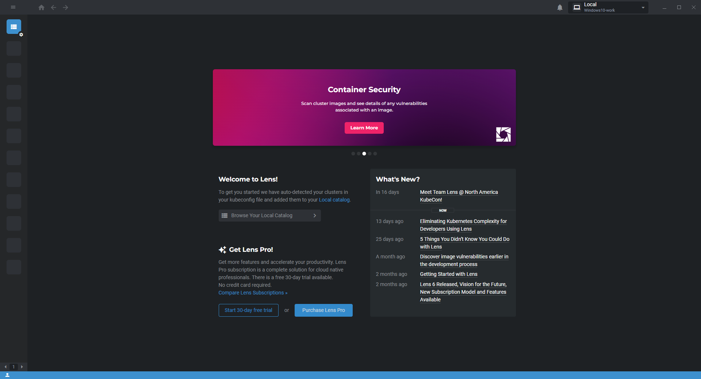
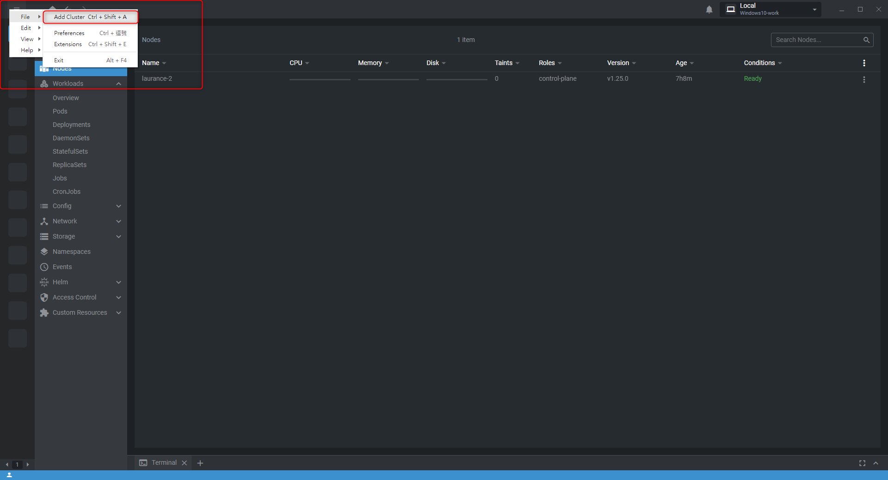
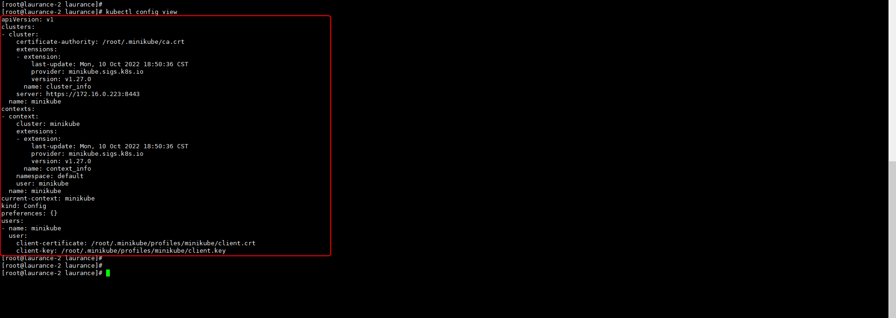
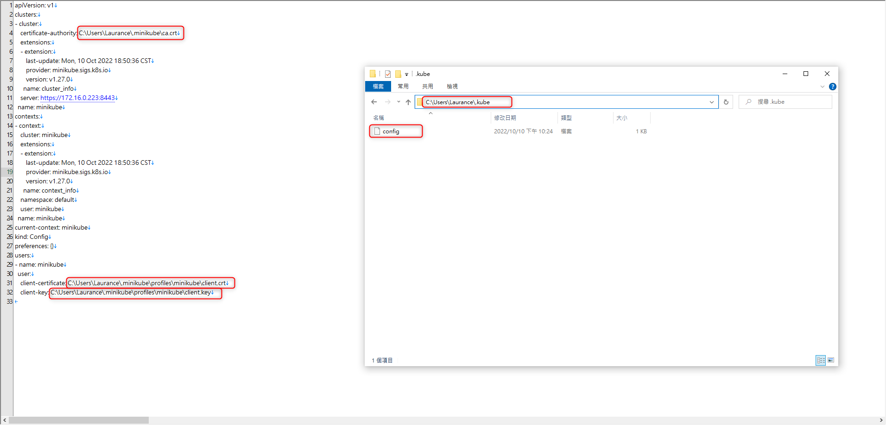
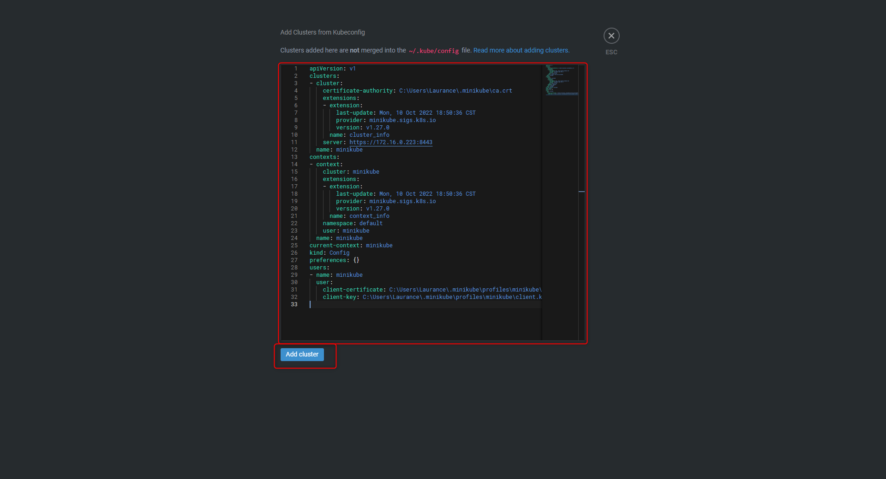
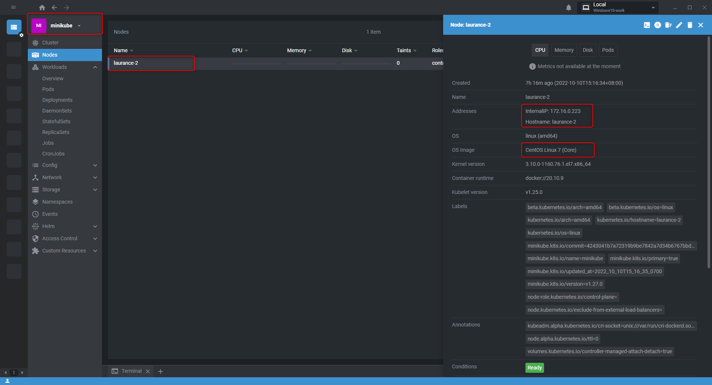

+++
author = "Hugo Authors"
title = "Kubernetes-Lens 使用指南 通過 IDE 管理 minikube"
date = "2022-10-10"
#description = ""
categories = [
    "Kubernetes"
]
tags = [
    "Kubernetes",
]
image = "100.png"
+++

**安装 LENS on Windows x64**

**[LENS 官方載點](https://k8slens.dev/)**

   
   
**右上三條線點選 File >> Add Cluster 新增集群**

   
   
**回到測試機上查看 minikube 設定檔**

    kubectl config view 
    
   
   
**將測試機裡的 .minikube 隱藏檔資料夾 winscp 取出放到對應位置**

    PWD: /root/.minikube

     
   
**將測試機裡的 .kube 隱藏檔資料夾 winscp 取出放到對應位置，並修改路徑**   

    PWD: /root/.kube
    
   
         
**將 .kube 下的 config 內容貼至 LENS >> File >> Add Cluster 新增集群**

   
   
**雙擊連接即可**

   
   
   

***




