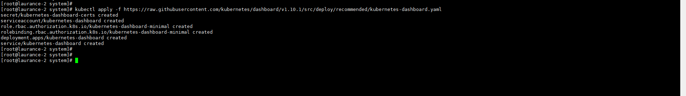
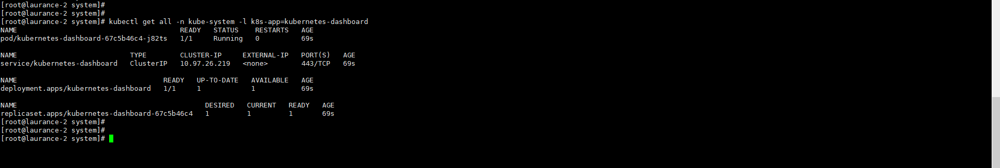
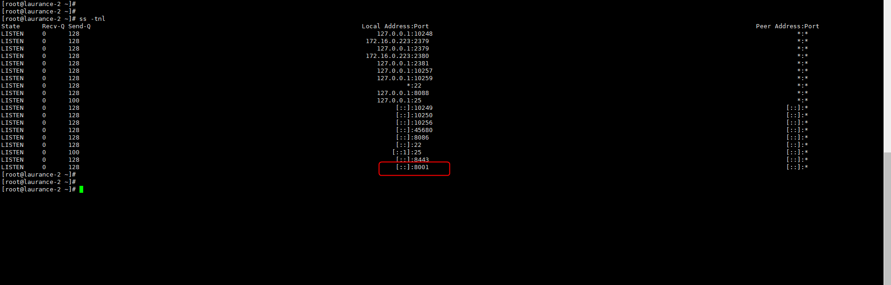
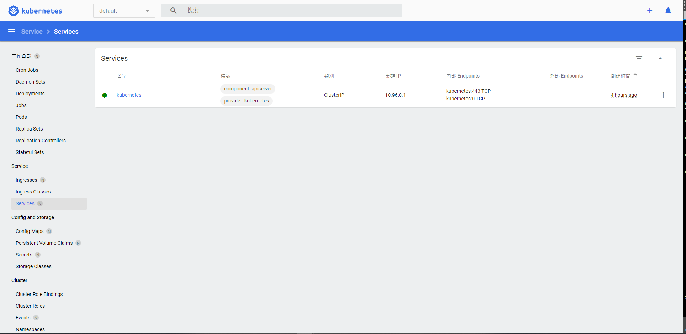

+++
author = "Hugo Authors"
title = "Kubernetes-在本地端上建立 Dashboard"
date = "2022-10-10"
#description = ""
categories = [
    "Kubernetes"
]
tags = [
    "Kubernetes",
]
image = "100.png"
+++

**[ Github Kubernetes Dashboard](https://github.com/kubernetes/dashboard) 這裡記錄一下安裝的過程**

    kubectl apply -f https://raw.githubusercontent.com/kubernetes/dashboard/v1.10.1/src/deploy/recommended/kubernetes-dashboard.yaml

   
   
   這樣就安裝好了，然後看一下正在運行的容器
   
    kubectl get all -n kube-system -l k8s-app=kubernetes-dashboard
    
   

   先把Iptables規則打開 (預設FORWARD是關閉的)
   
    iptables -P FORWARD ACCEPT
    
   確認火牆都關閉 firewalld && selinux
   
    systemctl stop firewalld
    
    getenforce >> disabled
    
   設置一層代理讓外部訪問 dashboard
   
    kubectl proxy --address='0.0.0.0' --disable-filter=true &
    
    PS. disable-filter=true表示禁用請求過濾功能，否則我們的請求會被拒絕，並提示 Forbidden (403) Unauthorized
    
   
    
   訪問 dashboard
   
    http://172.16.0.223:8001/api/v1/namespaces/kubernetes-dashboard/services/http:kubernetes-dashboard:/proxy/#/service?namespace=default
  
   

***




