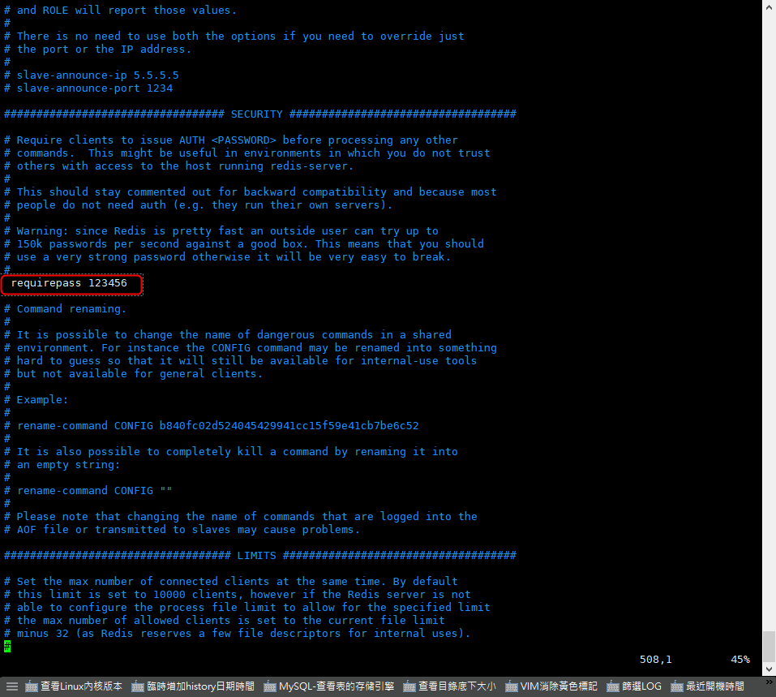

+++
author = "Hugo Authors"
title = "Redis-設置Redis密碼"
date = "2022-10-13"
#description = ""
categories = [
    "Database"
]
tags = [
    "Redis",
]
image = "100.png"
+++

**方法一**

    修改 redis 設定檔 (requirepass 參數)
    
    PWD: /usr/local/redis/etc/redis.conf
    
   
   
    修改完之後重啟服務
    
    service redis restart
   
**方法二**

    進服務修改 Password (此方法 Redis 重啟後，密碼會失效)

    # 設定密碼
    
    127.0.0.1:6379> config set requirepass 123456
    
    # 查詢密碼
    
    127.0.0.1:6379> config get requirepass
    
    # 驗證密碼
    
    127.0.0.1:6379> auth 123456
    
    127.0.0.1:6379> config get requirepass
    
    1) "requirepass"
    2) "123456"
       
    
**登入指令**

    redis-cli -p 6379 -a test123
    
    redis 127.0.0.1:6379> auth test123
    

***




