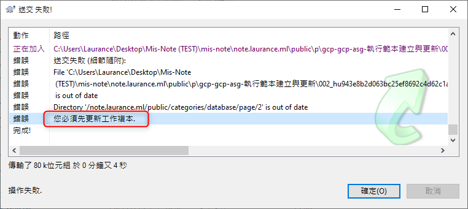
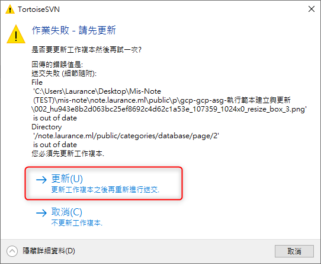

+++
author = "Hugo Authors"
title = "SVN-error 你必須先更新你的工作副本"
date = "2022-10-05"
#description = ""
categories = [
    "SVN"
]
tags = [
    "SVN",
]
image = "100.png"
+++

    SVN送交時失敗跳error "你必須先更新你的工作副本"
    
   
    按確定之後，會自動跳出 作業失敗-請先更新的視窗，再點選更新即可
   

***




