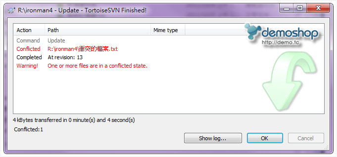
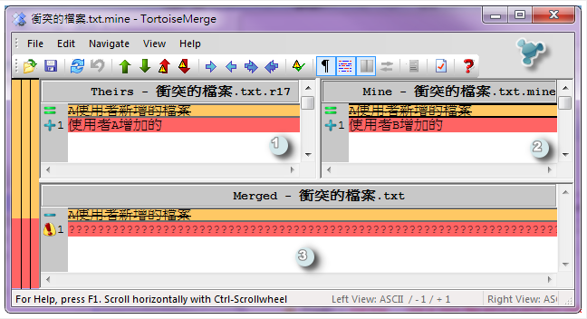
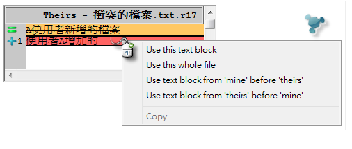
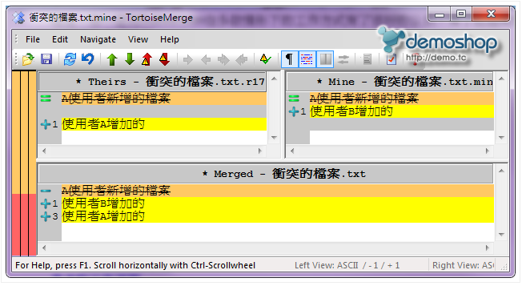
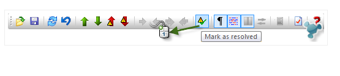

+++
author = "Hugo Authors"
title = "SVN-更新時發生衝突如何解決"
date = "2022-09-13"
#description = ""
categories = [
    "SVN"
]
tags = [
    "SVN",
]
image = "100.png"
+++

    在標示了衝突的那個檔案上點滑鼠左鍵兩下
    
    會自動開啟內建的合併工具
   
   
    左邊區塊是版本庫的檔案  
    
    右邊區塊是本機副本的檔案  
    
    底下區塊是合併後的結果，看得出來有一堆問號的部份就是無法自動合併的區塊  
    
    （也就是衝突）
   

    在左邊區塊衝突的部分按「滑鼠右鍵」就可以跳出相關的快顯功能表
     
    
    手動選擇後在下方的窗格會顯示合併後的結果
   
    
    將所有的衝突都處理完畢後按工具列上的圖示
     
***




