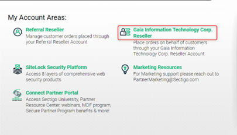
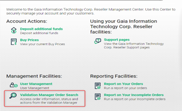
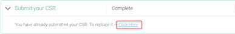
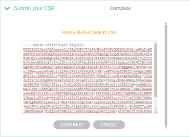

+++
author = "Hugo Authors"
title = "SECTIGO-改簽SSL教學"
date = "2022-10-03"
description = "(SECTIGO SSL改簽其他域名)"
categories = [
    "SECTIGO"
]
tags = [
    "SECTIGO",
]
image = "100.png"
+++

    Work搜索SSL簽發日期 		ps.到期日期往前推一年=簽發日期 2022-06-03
    
   
   
    進入SECTIGO後台，並點選訂單管理Gaia Information Technology Corp. Reseller
    
   
   
    點選訂單報告Report on Your Orders
    
   
   
    以簽發日期查詢訂單編號
    
   
   
    用訂單編號搜索憑證更換CSR
    
   
   
    進入管理層並點選訂單管理操作 Validation Manager Order Search
    
   
   
    輸入剛查詢的訂單編號進入修改
    
   
   
    點選修改 Submit your CSR ， 並將CSR黏貼進入，後面一直按CONTINUE即可
    
   
   
   
   
    憑證簽發完後，Mail會收到Sectigo寄來的zip包
    
   
   
    下載後會有4之檔案，
    
    將AAA CertificateServices.crt裡面的內容全部貼進STAR_XXX_net.crt的下面，並更名為域名.crt，
    
    再將域名.crt複製到網頁主機裡 
    
    (注意：STAR_XXX_net.crt內容一定要再上方，否則驗證不會過)
    
   
   
   

***




