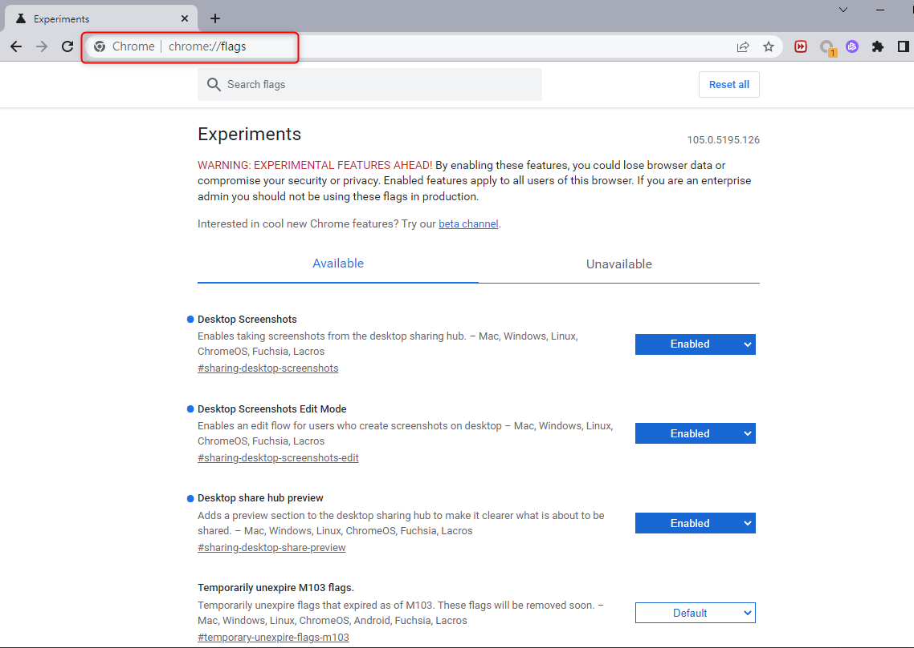
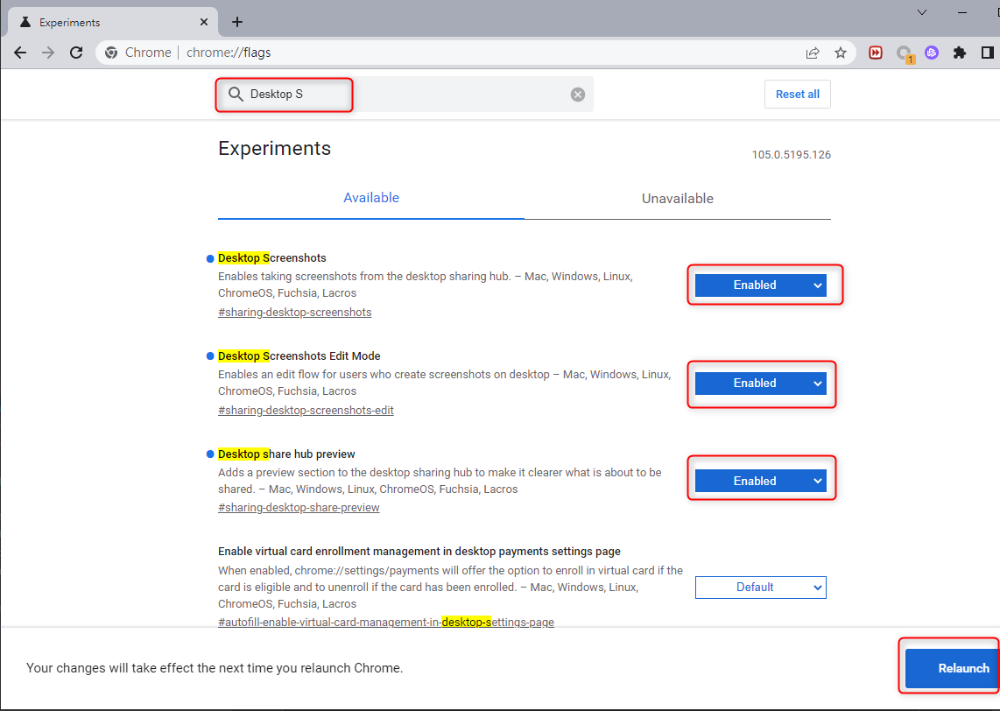
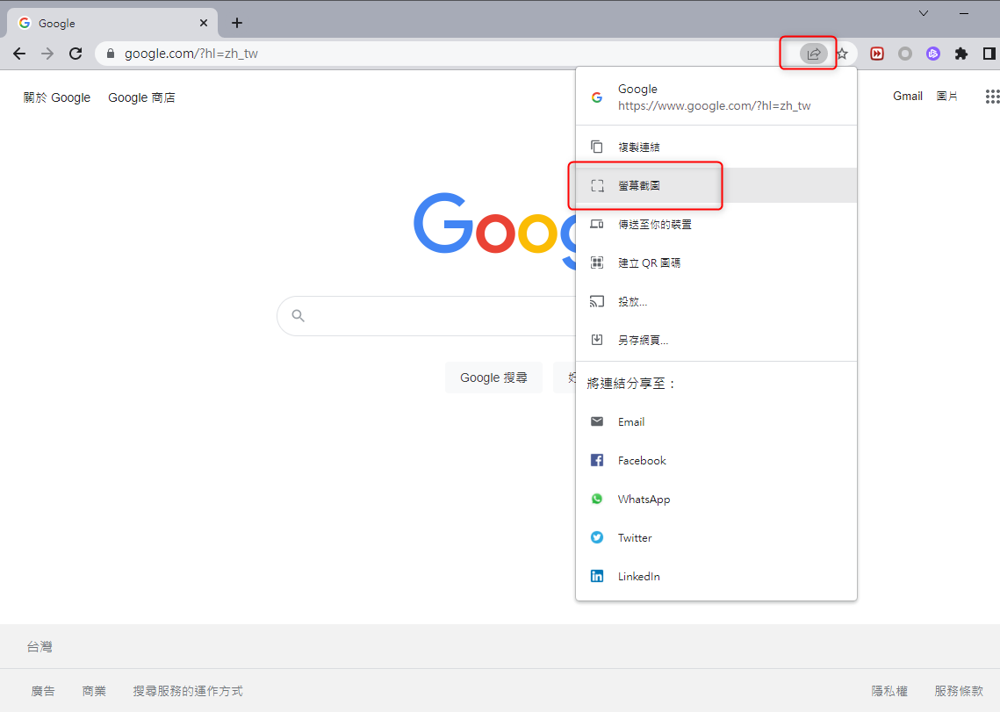
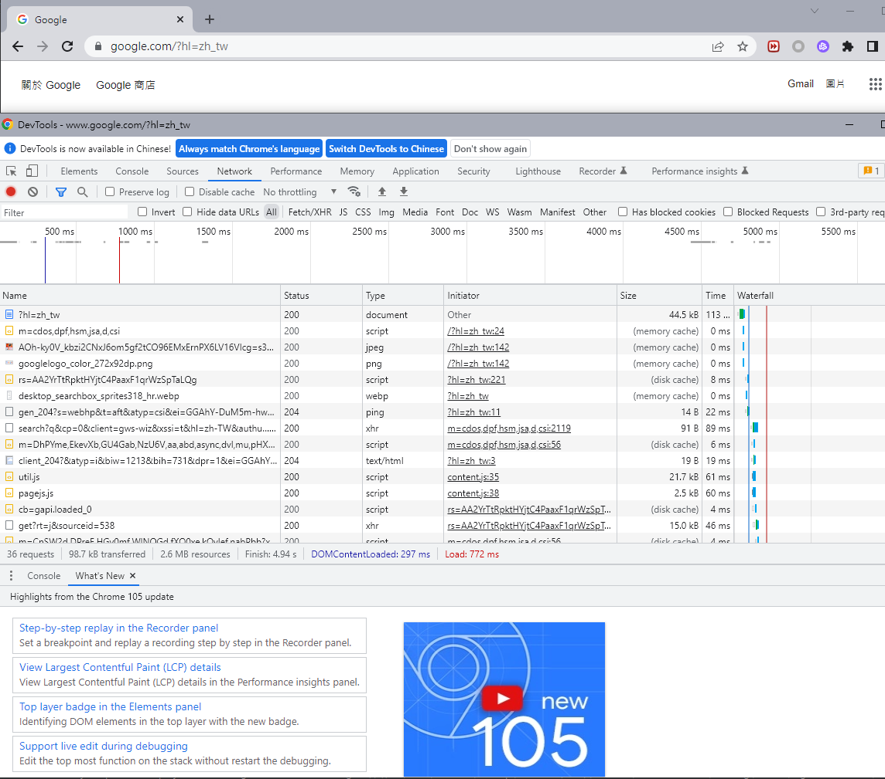
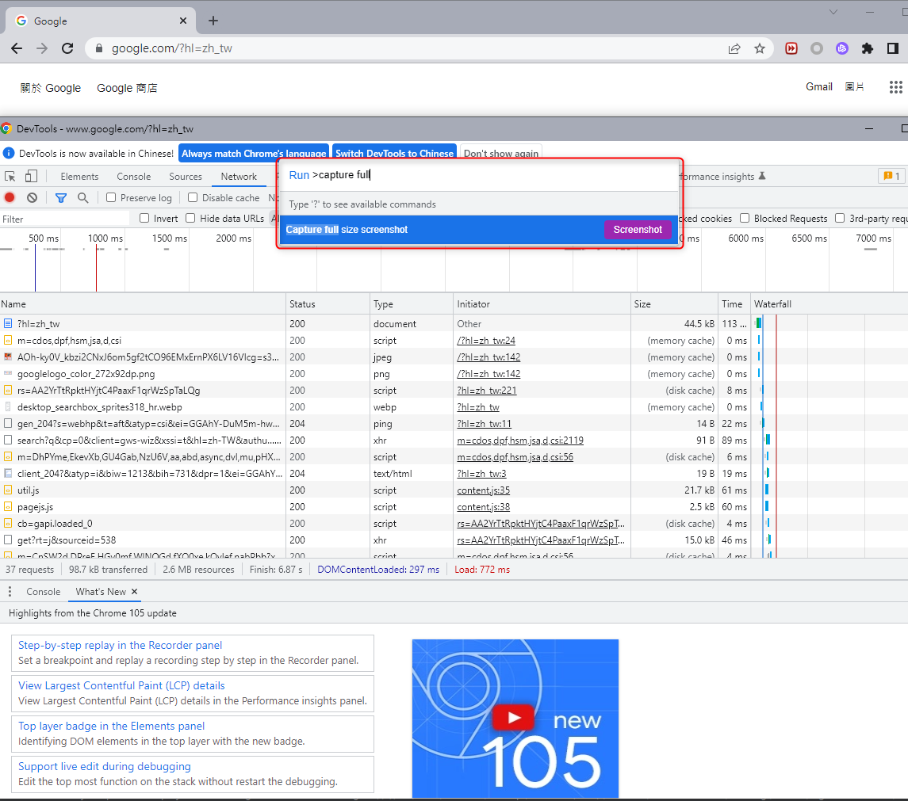

+++
author = "Hugo Authors"
title = "Windows-Chrome長截圖教學"
date = "2022-09-14"
#description = ""
categories = [
    "Windows"
]
tags = [
    "Windows",
]
image = "100.png"
+++

   方法1. 透過內建Chrome截圖實驗功能
    
    步驟 1. 開啟 Google Chrome 網頁後，直接在網址列輸入「chrome://flags/」會立即打開 Chrome實驗性功能
   
    
    步驟 2. 直接搜尋「Desktop Screenshots」、「Desktop Sharing Hub in Omnibox」、「Desktop Sharing Hub in App Menu」三項功能，全改為「Enabled」後，按下「Relaunch」重啟 Google Chrome 瀏覽器，就會啟用內建Chrome截圖快捷鍵隱藏功能
   
   
    步驟 3. 如果要截圖時，直接點擊 Chrome 網址列右側的「分享圖示」，再點選「螢幕截圖」功能
     
    
   方法2. 用內建Chrome 長截圖功能
   
    步驟1. 開啟 Google Chrome 瀏覽器後，先進入想要長截圖網頁，直接利用鍵盤按下F12快捷鍵，顯示開發人員資訊畫面
   
   
    步驟2. 接下來再利用快捷鍵呼叫Chrome瀏覽器指令選單：  
           並輸入長截圖指令
       
   
    Capture full size screenshot：長截圖
    Capture screenshot：一般截圖
    Capture node screenshot：預覽截圖
    Capture area screenshot：自選區域截圖




