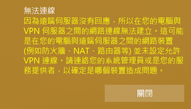
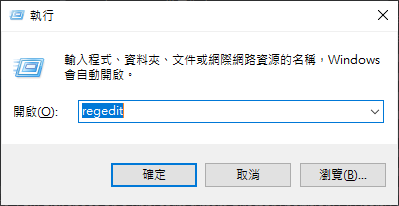
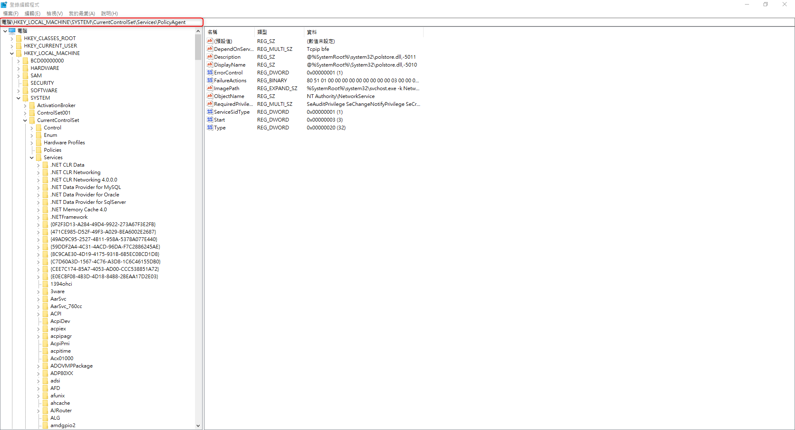

+++
author = "Hugo Authors"
title = "Windows 10 無法建立VPN連線"
date = "2022-09-27"
#description = "(與LINUX比較)"
categories = [
    "Windows"
]
tags = [
    "Windows",
]
image = "100.png"
+++

    出現以下錯誤訊息
   
   
    1.Win + R 輸入 regedit
   
    
    2.尋找此路徑 HKEYLOCALMACHINE\SYSTEM\CurrentControlSet\Services\PolicyAgent
   
    
    3.新增一組機碼 
    
    類型:DWORD (32-bit) 
    
    名稱:AssumeUDPEncapsulationContextOnSendRule
    
    4.並且將值設定為2
    
    5.重開機

***




