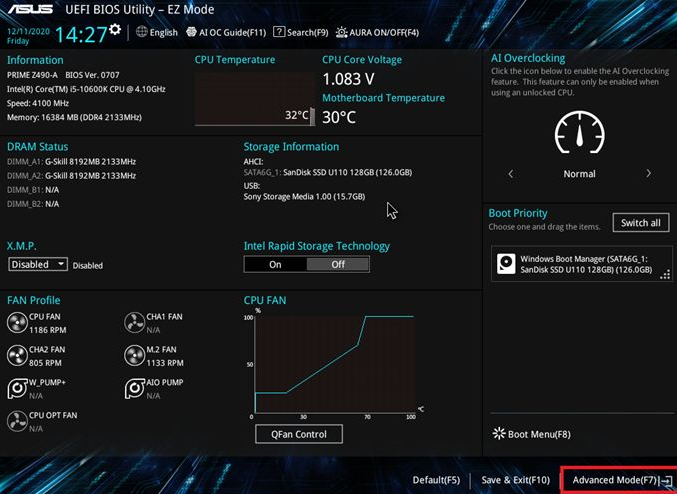
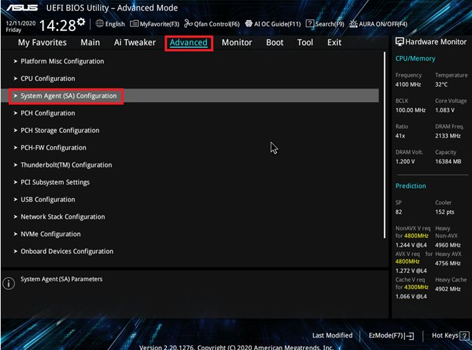
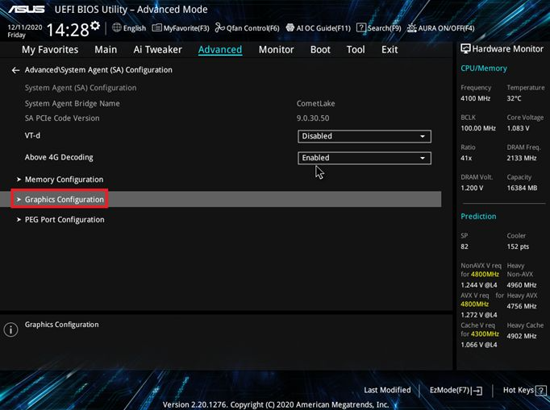
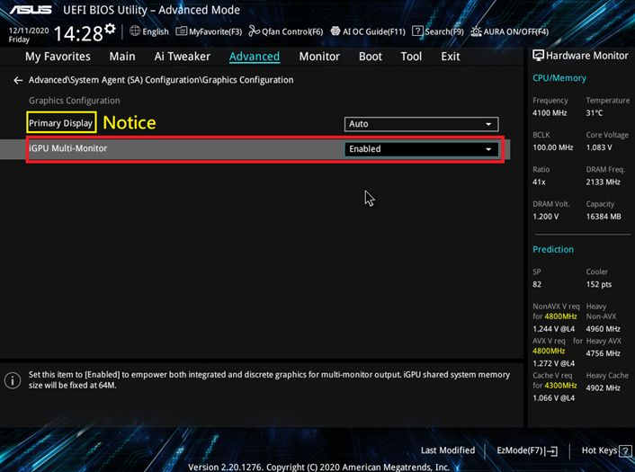

+++
author = "Hugo Authors"
title = "Windows-BIOS透過內顯與獨顯做多螢幕輸出"
date = "2022-08-10"
#description = ""
categories = [
    "Windows"
]
tags = [
    "Windows",
]
image = "100.png"
+++

進入BIOS
    
按F7進入進階模式
    

    
點選Advanced 頁面，進入System Agent (SA) Configuration

    
在System Agent (SA) Configuration底下點選Graphics Configuration
    

進入Graphics Configuration項目後，把iGPU Multi-Monitor選項設定為Enable
    
(Primary Display可以設定螢幕顯示方式:  1.為自動偵測(Auto)或 2. 獨立顯示卡(PCIE)輸出或  3. 內建顯示(iGPU) 輸出)
    

    
按F10儲存後重新開機
    
WIN+X+M 進入裝置管理員
    
在裝置管理員，可以看到內建顯示晶片和外接獨立顯示卡兩個顯示卡輸出裝置    

***




